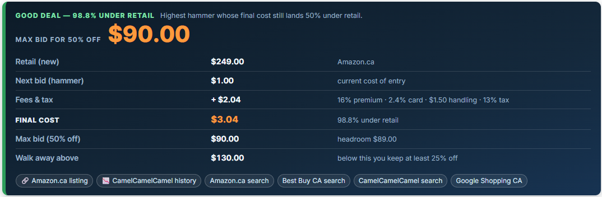
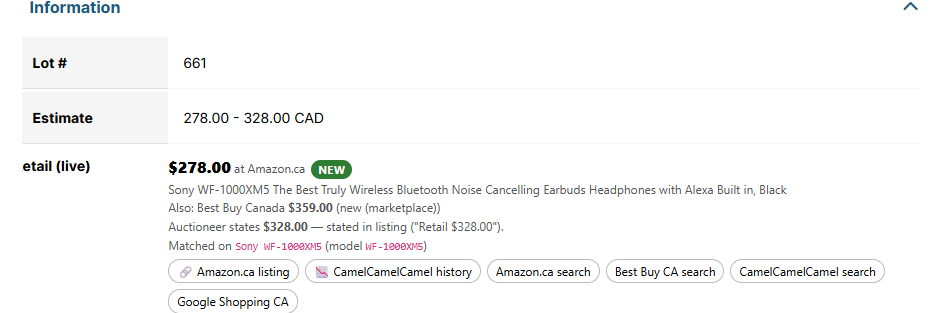
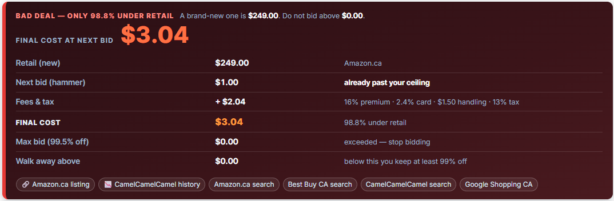
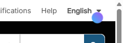
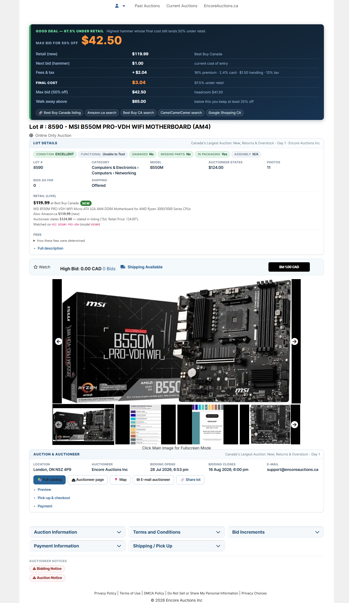
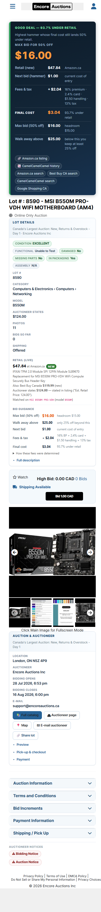
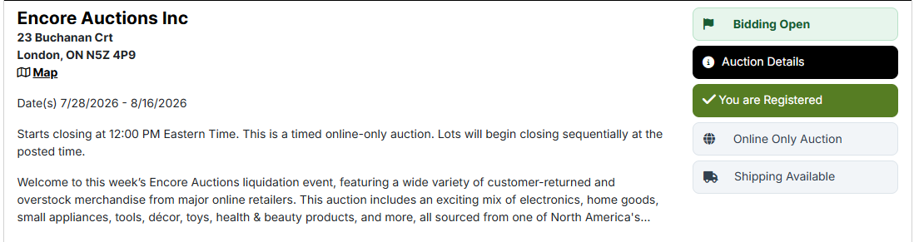
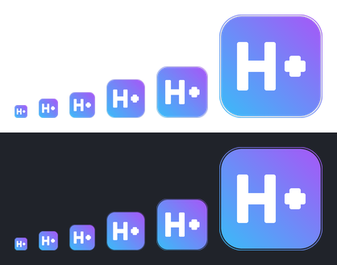

# HiBid Enhancer Suite

A Tampermonkey userscript that turns a HiBid lot page into a decision.

It reads the lot's own description, finds what the item actually costs new in
Canada, parses the auction's fee schedule out of its terms, and tells you the
highest hammer price that still beats retail after **buyer's premium + handling
fees + HST**. It shouts at you when a lot is a bad deal, and shouts louder when
the lot is broken.





When the price is too close to retail the same panel turns red and leads with
what you are about to pay instead of a ceiling:



## What it does on a lot detail page

| Feature | Detail |
|---|---|
| **Product identification** | Extracts the real product name from the lot description, stripping the `Retail $328.00 \|` prefix, the `****` separator and the auctioneer's `Notes:` block. Builds a tight search query (`Sony WF-1000XM5`), keeping capacity where it moves price (`CORSAIR Vengeance DDR5 32GB`). |
| **Live retail price** | A **Retail (live)** block in the Lot details card, with the price, the matched product title, a condition badge, and deep links — including a CamelCamelCamel price-history link for the exact ASIN. Falls back to a row beneath the auctioneer's **Estimate** row if the card cannot be built. |
| **Fee-aware bid ceiling** | A **Bid guidance** block shows `BID UP TO $X` — the highest hammer price whose all-in cost still clears your target discount — rounded down to a bid the site will actually accept. |
| **Reordered page** | Lot details, watch and bid above the photos; location, dates, auctioneer and share/catalog buttons below them; the six accordions in a grid; the notices demoted to links at the foot. See [Lot detail page layout](#lot-detail-page-layout). |
| **Summary panel** | One dark panel at the top of the page: the decision in 40px type, then a table of retail / next bid / fees & tax / **final cost** / max bid / walk-away. Styled from HiBid's own palette (brand blue `#266296`, near-black, their orange `#e65100`); money that leaves your pocket is orange. |
| **Red bad-deal panel** | If the next required bid lands less than 25% under retail the panel turns red and the hero number becomes the final cost you are about to pay, not a ceiling. |
| **Parts-only banner** | 💀 If the **lot's own** description says parts-only / broken / damaged / `Is Item Damaged? Yes`, a black-and-red banner goes above everything else, and **all retail comparison and bid advice is suppressed** — a working unit's price is not a valid comparison for a broken one. |
| **Fee provenance** | Every fee is shown with the exact sentence it was parsed from, so a wrong number is traceable instead of magic. |
| **Never blocks the page** | Two-pass rendering: everything derivable from the DOM appears instantly, the network lookup runs detached. A pulse loader in the top-right corner shows while it is in flight. |

### Nothing waits on the network

The lot page renders and stays interactive throughout. Enhancement happens in two
passes:

**Pass 1 — synchronous.** Condition banners, the parsed fee stack, the all-in cost
of the next bid, and provisional guidance from the auctioneer's own stated retail.
Rendered immediately from the DOM, no network involved.

**Pass 2 — detached.** The live retail lookup is fired *without* being awaited, so
the controller returns straight away. While it is in flight a 20px pulsing
gradient dot sits at `top: 25px; right: 25px`, and the provisional figures are
labelled *unverified* / *provisional*. When the quotes land, the retail row, bid
guidance and verdict banner re-render in place.



Concretely, on the reference lot with a deliberately slowed network:

| | Retail shown | Ceiling | Loader |
|---|---|---|---|
| **at 1.2s** | $328.00 — auctioneer's claim, `UNVERIFIED` | BID UP TO **$122.00** *(provisional)* | visible |
| **after lookup** | $278.00 at Amazon.ca, `NEW` | BID UP TO **$104.00** | hidden |

A generation counter drops stale results, so a slow lookup for a lot you have
already navigated away from can never overwrite the current one.

### Structured description fields

Many auctioneers write the description as a field block rather than prose:

```
Est. Retail Price: 251.00
Condition: BRAND NEW - OPEN BOX
Model: NT-USB+
Is Item Functional? Yes
Is Item Damaged? No
Missing Major Parts? No
```

These are parsed as fields, not scanned as text, and that distinction matters:
the *label* "Is Item Damaged?" contains the word "damaged" and "Missing Major
Parts?" contains "parts", so a keyword scan flags a brand-new item as broken.
Yes/No answers are read as answers — `Is Item Damaged? No` means not damaged —
and the keyword scan only ever runs on the `Condition:` value and the remaining
prose. `Model:` is also used as the search token, which is how `NT-USB+` (a model
code with no digits in it) survives into the query.

### The money

```
premium  = hammer × premium%
card     = (hammer + premium) × card%          (only if the terms mention one)
handling = per-item fee + large-item fee       (large-item only for appliances)
all-in   = (hammer + premium + card + handling) × (1 + tax%)

max hammer for a target discount d:
  budget  = retail × (1 − d)
  hammer  = (budget ÷ (1 + tax%) − handling) ÷ ((1 + premium%) × (1 + card%))
```

Worked through on the lot this was built against — Sony WF-1000XM5, retail
**C$278** on Amazon.ca, terms of *16% Buyer's Premium plus HST, $1.50 handling per
item*, Ontario 13% HST:

| Hammer | Premium | Handling | Tax | All-in | vs retail |
|---|---|---|---|---|---|
| $31.00 | $4.96 | $1.50 | $5.02 | **$42.33** | 84.8% under |
| $104.00 | $16.64 | $1.50 | $15.87 | **$138.01** | 50.4% under ← the ceiling |
| $157.00 | $25.12 | $1.50 | $23.92 | **$207.54** | 25.3% under ← walk away |

So the script reports **BID UP TO $104.00** for a 50%-off deal, with a hard
walk-away at **$156.00**.

Tax is applied to the whole invoice (hammer + premium + fees), which is how
Ontario auctioneers bill it.

## Lot detail page layout

HiBid's own lot page asks you to scroll past a promotional banner, a 600px photo
and two full notice cards before reaching a single number you can act on, and
then puts the lot's actual details in an accordion below the fold. The script
reorders it around the question you came to answer.

| Order | Block | Notes |
|---|---|---|
| 1 | Summary panel | The decision, unchanged: hero number, cost table, condition banners. |
| 2 | Lot title | HiBid's own `<h1>`. |
| 3 | **Lot details** card | Condition chips, the facts grid, **Retail (live)**, **Bid guidance**, and the description folded away. |
| 4 | Watch / bid strip | HiBid's own watch control, high bid, time remaining and Bid button, on one row. |
| 5 | Photos | The gallery, capped at 900px so a full-width column does not make it 1200px tall. |
| 6 | **Auction & auctioneer** card | Location, dates, auctioneer, contact, and catalog / auctioneer / map / e-mail / share as buttons. |
| 7 | Collapsible panels | HiBid's six accordions, in a responsive grid. |
| 8 | Auctioneer notices | Two links; click to expand the full text. |



### Nothing Angular owns is moved

Re-parenting a component out of an Angular template is how a userscript breaks on
the next deploy. So the reorder is `flex-direction: column` plus `order` on the
columns HiBid already rendered — its nodes stay exactly where its change
detection expects them.

The blocks that appear to move to the bottom box are not moved. The originals are
hidden with `display: none` and the box is rebuilt from their own `href`s, read
out of the DOM rather than guessed, so **Full catalog** and **Auctioneer page**
point at exactly what HiBid's buttons pointed at. Share is the one replacement:
it uses `navigator.share` where available and the clipboard elsewhere, because
borrowing `app-share`'s click handler would mean depending on it.

Hiding is deliberately done twice — a class set on each run, plus `:has()`
selectors that survive an Angular re-render that replaces the nodes and takes the
class with them. The `:has()` rules sit in their own declaration blocks so a
browser without support loses those lines instead of the whole stylesheet.

The **Information** accordion is hidden rather than emptied, because
`enhanceDetail` still reads its table on every run — `textContent` works fine on
a `display: none` subtree — and it is only hidden once the replacement card is
actually on the page. If the card cannot be built, the **Retail (live)** and
**Bid guidance** rows are inserted into HiBid's table exactly as before.

### Notices become links

The Bidding and Auction notices are two always-open cards, 230–250px of text
above the lot's own details. They become two small links at the foot of the page.

Expanding one shows **more** than the card did. HiBid renders roughly the first
400 characters followed by a *Show More* anchor and fetches the rest on demand,
so the DOM copy is genuinely incomplete: on lot 316725406 the Bidding Notice is
447 characters in the page and 842 from `auction(id) { biddingNotice }`. The link
opens the GraphQL text when it arrives and a clone of the truncated card until
then — a clone, so the auctioneer's own links stay clickable.


### Pass 3 — GraphQL enrichment

A third detached pass fills in what the lot page does not put in the DOM at all.
Every field was verified against the live endpoint by sending it and reading the
error, since introspection is blocked and an unknown field is named in the
response:

- `lotSearch(eventItemIds: [id])` → `quantity`, `pictureCount`, `shippingOffered`,
  the `category` tree, and `lotState { bidCount minBid highBid }`.
- `auction(id)` → `bidOpenDateTime`, `bidCloseDateTime`, `previewDateInfo`,
  `checkoutDateInfo`, `paymentInfo`, the untruncated notices, and
  `auctioneer { name address city state postalCode email phone }`.

`bidAmount` exists on `Lot` and is **not** used: on a lot with no bids it came
back as `123.45` while `lotState.highBid` was `0`.

Like pass 2 this is fired without being awaited and guarded by the same
generation counter, so a slow or failing call leaves the DOM-derived card on
screen rather than an empty one.

Two details worth knowing:

- **Location is the page's, not the auctioneer record's.** They differ. OnDeals
  is registered at L8B 1X6 while lot 316725406 is collected at L8E 5P4, so the
  location row keeps HiBid's own city/state/zip and the auctioneer's postal
  address is a separate row that only appears when it adds something.
- **Timestamps are formatted as strings, not `Date`s.** The API returns
  `2026-08-12T19:00:00` with no offset — it is already the auction's local wall
  clock. `new Date()` would apply the viewer's timezone and reprint a 7:00 PM
  close as 11:00 PM for anyone west of the auctioneer.

### The auctioneer's banner

On an auctioneer subdomain the header slot holds a promotional image the
auctioneer uploaded — 172px on `encoreauctions.hibid.com`, with no upper bound —
advertising the sale you are already looking at. It is hidden on lot pages.

The test is the image's **rendered height**, not its selector: hibid.com's own
wordmark sits in the same slot, and a rule that removed "the header image" would
strip the site's identity on the main domain to fix a problem that only exists on
the subdomains.

### What this costs in page height

Measured at 1280px on both reference lots, released version versus this one:

| | encore lot 317094503 | hibid lot 316725406 |
|---|---|---|
| Collapsible panel stack | 330px → **90px** | 330px → **90px** |
| Information accordion | 694px → 0 (hidden) | 686px → 0 (hidden) |
| Notice cards | 251px → 0 (links) | 230px → 0 (links) |
| `app-lot-details` total | 1720px → **2220px** | 1699px → **2257px** |
| DOM nodes | 650 → 743 | 996 → 1083 |

The accordion goal is met decisively and ~1,180px of always-on boilerplate leaves
the flow, but **the content region is ~30% taller overall**, because the two new
cards surface more than they replace: the auction and auctioneer details were
previously only inside a collapsed accordion, and the retail and bid figures now
sit above the photos instead of below them. Everything added is one screen from
the top rather than three.

The largest remaining duplication is deliberate: the **Bid guidance** block
repeats the summary panel's table almost row for row. Both are kept because both
are documented features; folding the block would reclaim about 115px.

For comparison, the same lot before the redesign:
[docs/screenshot-detail-before.png](docs/screenshot-detail-before.png). The other
reference lot on the main domain, after:
[docs/screenshot-detail-redesign-hibid.png](docs/screenshot-detail-redesign-hibid.png).

### Narrow screens

Both grids are `repeat(auto-fit, minmax(…))`, so the six accordions and the facts
collapse to one column on their own, and the bid strip is a wrapping flex row
rather than a fixed layout. Checked at 420px: single column throughout, no
horizontal overflow.



## SPA navigation

HiBid is an Angular app, so Next / Previous / First / Last in the lot pager is a
router navigation, not a page load. Two things went wrong there.

**The URL changes before the content does.** Enhancing in that window read the
*previous* lot's rows and pinned its retail price and bid ceiling onto the new
lot — and because the run then recorded the new path as done, the MutationObserver
never came back to correct it. The enhancement appeared to stop working for the
rest of the session.

HiBid stamps the container with the lot id it actually rendered
(`#lot-details-317094503`), so the mismatch is directly observable. When the URL
and that id disagree the run declines, leaves its "done" marker unset, and the
observer keeps kicking until the DOM catches up. The guard only engages when that
container exists, so a page that does not stamp an id behaves as before rather
than losing the enhancement entirely.

**`pushState` fires no event.** Navigation was detected only by a 500ms poll of
`location.pathname`, which missed anything that changed just the query string.
The two history methods are now wrapped, `popstate` and `hashchange` are handled,
and the poll remains as a backstop. On navigation the previous lot's panel, cards
and notices are cleared immediately and the generation counter is bumped, so a
late answer for the old lot cannot paint itself onto the new one.

Verified on lot 316725406: a `pushState` to another lot id clears the summary
panel, the info card and the auction box within 200ms; while the URL is ahead of
the DOM no card is built from the stale rows; returning to the real URL
re-renders the correct lot.

## Measuring it

A userscript running at `document-idle` inside someone else's Angular app is easy
to make slow by accident and impossible to tune by feel, so every stage of the
detail pass is timed. The last run is left on `window.__hesPerf`:

```js
__hesPerf
// { tag: 'detail + graphql', total: 7.8,
//   spans: [ {label:'infoRows', ms:0.1}, {label:'parseFees', ms:0.1}, … ],
//   counters: { 'panel scan': 1, 'gql memo hit': 1, 'mutation batches': 1 },
//   layout: { docHeightPx: 2385, domNodes: 743 } }
```

Recording is two clock reads and an array push per span, so it stays on; only the
console summary is behind the `debug` setting.

Measured on lot 317094503, 1280px viewport:

| Span | ms |
|---|---|
| `infoRows` | 0.1 |
| `parseFees` | 0.1 |
| `page links` | 0.2 |
| `info card` | 0.7 |
| `layout` | 1.8 |
| `auction box` | 0.3 |
| `notices` | 0.2 |
| `renderQuotes (pass 1)` | 1.5 |
| **synchronous total** | **~8ms** |
| `gql lot` / `gql auction` (detached) | 1,700–3,600 each |
| `enriched render` | 2.9 |

The synchronous pass is not where the time goes — the network is, and it is
already detached. Three things were still worth fixing, and all three came out of
these numbers:

**Panel text was scanned three times per render.** `Detail.panel()` walked every
`app-collapse-panel` and lower-cased its whole `textContent` to match a heading,
and `enhanceDetail` asks for three different panels. Terms and Conditions alone is
a few KB, so the entire auction boilerplate was scanned and lower-cased three
times. Headings live in `.collapse-header`, which is a few words, so it now
matches on that and caches the list for one run: the `panel scan` counter reads
`1` instead of `3`.

**The fee parser re-ran on identical text.** `parseFees` runs some forty regexes
over the whole boilerplate, which is byte-identical for every lot in a sale and
across every re-render. It is memoised on a cheap fingerprint — length plus the
first 48 characters of each source — rather than a full hash, which would cost
about as much as the parse.

**GraphQL was fetched twice per lot and serially.** `enhanceDetail` legitimately
runs more than once (the initial kick and the first Angular re-render both land
before the "done" marker is set), and each run fired its own pair of requests for
identical answers — visible as two `gql lot` spans of 1.7s and 2.8s in one report.
The promise is now memoised per lot id, so overlapping runs join one request; the
`gql memo hit` counter confirms it. And because the auction id is already in the
page's own Catalog link, the auction query no longer waits for the lot query:
`gql auction (parallel)` measured 0ms on hibid.com because it had already resolved
by the time the lot query returned. Worst case the enrichment went from
~3.4s of chained round trips to ~1.7s.

### Not changed, and why

The DOM copy of a notice is truncated at ~400 characters, so a fee stated only
in the notice text — Encore's 2.4% card processing fee sits about 600 characters
in — is invisible to `parseFees` today. The full text is available from
`auction(id) { auctionNotice }`, which pass 3 already fetches. Feeding it to the
fee parser would be a correctness improvement, and it was deliberately left out:
it changes every ceiling on the page, and it would change them *after* the
summary panel had already rendered. It belongs in a change that owns the money
path, not in a layout change.

## Retail price sources

There is **no free official API for Amazon.ca prices** — Amazon's Product
Advertising API requires an approved affiliate account with qualifying sales,
CamelCamelCamel publishes no API, and Keepa is subscription-only. See
[docs/PRICING-SOURCES.md](docs/PRICING-SOURCES.md) for the full evaluation.

What the script uses instead, in priority order:

1. **Amazon.ca** — the search page, parsed in the browser via
   `GM_xmlhttpRequest`. No key. Sponsored placements are dropped, accessories are
   rejected, and the ASIN is captured so the CamelCamelCamel history link is
   exact.
2. **Best Buy Canada** — `bestbuy.ca/api/v2/json/search`, an undocumented but
   open, key-free JSON endpoint. Used as an independent cross-check.
3. **The auctioneer's own figure** — the `Retail $…` in the title, an
   `Est. Retail Price:` field, or the top of the Estimate range. Shown as
   *unverified*, and used only when nothing live could be found.
4. **Keepa** *(optional, paid)* — CamelCamelCamel-grade history behind an
   official API. Off by default; add a key in the settings menu to enable.

The cheapest **brand new** quote wins. Used and open-box quotes never set the
benchmark while a new price exists, because comparing an auction lot to a used
price hides how bad the deal is.

**No API keys or secrets are required for the default setup.** Nothing needs to
go in 1Password — see the note in [docs/PRICING-SOURCES.md](docs/PRICING-SOURCES.md).

### Why accessory filtering matters

`Spigen Rugged Armor Designed for Sony WF-1000XM5 Case` matches the brand *and*
the model perfectly and costs **$26.99**. Left unfiltered it becomes "retail",
the lot reads as *61% over* retail, and the recommended ceiling collapses to
**$9.00** — the exact opposite of the truth. Three independent signals reject it:

1. an explicit `for` / `designed for` / `compatible with` / `replacement for` marker,
2. a leading brand that differs from the product's brand (behind any `Open Box -` prefix),
3. an accessory noun positioned *before* the product identity — `Case for Sony WF-1000XM5`
   is an accessory, while `Sony WF-1000XM5 Earbuds with Charging Case` is not.

A lot that genuinely *is* an accessory skips all three, so cases and cables still
get priced.

## Install

1. Install [Tampermonkey](https://www.tampermonkey.net/) (Chrome, Edge, Firefox).
2. **[→ Click here to install the script](https://raw.githubusercontent.com/dgomesbr/hibid-enhancer-suite/main/src/hibid-enhancer.user.js)** —
   Tampermonkey intercepts the `.user.js` URL and shows its install page.
3. Open any HiBid lot page.

Pinned to the tagged release instead of `main`:
[v0.1.0](https://raw.githubusercontent.com/dgomesbr/hibid-enhancer-suite/v0.1.0/src/hibid-enhancer.user.js).
Installing from `main` is recommended — `@updateURL` points there, so
Tampermonkey picks up new versions automatically.

Tampermonkey will ask to allow cross-origin requests to `amazon.ca` and
`bestbuy.ca` the first time. Both are needed for price lookups; deny them and the
script falls back to the auctioneer's stated retail.

## Settings

Tampermonkey's menu on a HiBid page:

- **settings** — target discount (default 50%), red-warning threshold
  (default 25%), fallback buyer's premium (default 18%), per-provider toggles,
  optional Keepa key.
- **clear price cache** — lookups are cached 12h per query.
- **re-run on this page** — clears the cache and re-renders.

The Keepa key is stored in Tampermonkey's own storage on your machine. It is
never sent anywhere except `api.keepa.com`.

## Tests

```bash
node test/run-tests.mjs            # 220 assertions, no dependencies

npm install --no-save linkedom     # provides DOMParser for Node
node test/run-provider-tests.mjs   # 29 assertions against real captured responses
```

`test/fixtures/` holds trimmed but otherwise untouched real responses from
Amazon.ca and Best Buy Canada, so a markup change at either retailer surfaces as
a test failure rather than a silently wrong price.

The suites cover the fee parser against five real auction fee wordings, the
round-trip property that `allIn(maxHammerFor(retail, d)) == d% under retail`
across prices and targets, bid-increment rounding, province tax detection,
parts-only detection, and every accessory/homonym trap found while building this.

## Catalog / lot-list pages

On a catalog page (`/catalog/<id>`) every lot tile gets two additions:

| | |
|---|---|
| **Final price on the bid button** | `Bid 1.00 CAD` becomes `Bid 1.00 (3.04) CAD` — the real out-the-door cost of that bid under the auction's own fees. Just the bracketed number: the currency and the "Bid" label are already on the button. A dashed underline means the auction's terms could not be read and the figure uses the fallback premium. |
| **Deal dot after the shipping icon** | Colour-coded by final cost as a share of the new price. Hover for the discount. |

| Dot | Final cost vs new | Meaning |
|---|---|---|
| 🟢 green | under 50% | great |
| 🟡 yellow | 50–65% | good |
| 🟠 orange | 65–75% | marginal |
| 🔴 red | over 75% | poor once fees are counted |
| ⚫ dark red | — | parts-only lot, not priced against a working unit |
| ⚪ grey | — | no retail price found |

### Decluttered tiles

A catalog page spends its vertical space on things you read once and repeats
per-lot furniture 100 times. Everything below is *hidden*, never deleted —
Angular owns these nodes and will re-render them, so removal fights change
detection and can blank a tile. Hiding is done in a stylesheet rather than inline
styles for the same reason: an inline style set before a re-render is simply lost.
Set `catalogTidy: false` to switch it all off.

| Removed | Why |
|---|---|
| Bidding Notice, Auction Notice | Read once, cost a screenful every visit. Both become links in a footer block with the full text one click away. |
| ~~Lot thumbnails~~ | **Kept, shrunk to 96 px.** Hiding them outright had a consequence worth recording: a lazy image inside a `display:none` subtree never enters the viewport, so it never loads — hiding the container did not merely hide the photos, it guaranteed they could never appear. Set `catalogHideImages: true` for the old behaviour. |
| Watch control | 100 copies of a control you use on one lot. |
| Share and Print | Page furniture. Note the per-lot bid buttons also carry the class `print`, so matching that class alone would have removed the bid button from all 100 tiles. |
| The word "Lot" before every number | `Lot 9712` → `9712`. |

Auction Details and Registered / Register to Bid move up beside the auction's
status badges, where they belong.


Measured on the 100-lot page:

| | stock | v0.7.0 (no photos) | now |
|---|---|---|---|
| Tile height | 368 px | 155 px | **~200 px** |
| Photos | 150 px | none | **96 px, lazy** |

Releasing the tile's `min-height: 296px` floor is what actually shortens it — the
photo column alone was never the whole 213 px.

No separate lazy-loading patch is needed: HiBid already sets `loading="lazy"` on
101 of 104 images, so they load as you scroll. What *broke* loading was hiding
their container, since a lazy image that never enters the viewport never fetches.

### Auction header box

The header carried a marketing image, a 686-character blurb and a stack of
mismatched controls — 336 px before you reached a single lot.



- The promo image is hidden. With no product photos left on the page, a banner is
  the only picture on it and earns nothing.
- The blurb is clamped to three lines with a **Show more** toggle. HiBid ships an
  `app-read-more` component but it renders fully expanded here (231 px).
  Expanding releases the height and overflow of HiBid's own wrappers too, and
  restores their original inline values on collapse — releasing only the inner
  element left the extra text inside a still-clipped box, cut off mid-sentence.
- The right-hand controls are equalised to one uniform pill each, 247 × 40 px.

That last one needed care. The controls are not siblings: `app-auction-status` is
a *wrapper* holding two badges inside `.mb-3` divs, so styling the wrapper as a
single item produced exactly the mismatch it was meant to fix — heights
`148/38/38/38/78/38`, widths `247/168/168/168/114/247`. The fix is to flatten
every wrapper with `display: contents` so each real control becomes a direct flex
child of the column, then style the controls.

Header height drops from 336 px to 274 px, and the prose column takes the width
freed by the image.

### How it stays fast

100 lots would be 100 page fetches scraped from the DOM. Instead the module uses
HiBid's own GraphQL endpoint — the same one the app calls — so the whole page
costs **two requests**:

- `lotSearch(eventItemIds: […])` — every lot's description in one POST, which is
  where `Est. Retail Price`, `Condition` and `Model` live. The tiles themselves
  carry only a title and a bid.
- `auction(id) { termsAndConditions buyerPremium }` — the fee text, which a
  catalog page never renders.

Neither needs authentication for public catalogs. Then:

1. **Pass 1** (no per-lot network) writes the final price onto all 100 tiles at
   once — typically under 4 seconds.
2. **Pass 2** looks up retail in batches of 6 (`catalogBatchSize`, 5–10) with a
   350 ms gap between batches, painting each dot as its batch lands. The pulse
   loader stays up until the sweep finishes.

Results are cached 12 h per query, so a second visit — or another page of the
same auction with overlapping products — paints almost instantly. Navigating
away mid-sweep abandons the remaining batches.

Three further savings, measured on that same 100-lot page:

| | |
|---|---|
| **Fees memoised by price bucket** | Lots at the same bid with the same large-item status have an identical fee stack. On a page sorted by bid count every lot opened at $1.00, so **100 fee computations collapsed to 1**. |
| **Concurrent duplicate lookups joined** | Catalogs list the same product repeatedly. The 12 h cache only helps once a result has landed, so two tiles in the same batch would each fire their own provider pair. **83 distinct queries covered 100 lots.** |
| **Two requests to HiBid, not 100** | Both GraphQL calls together, for the whole page. |

If the auction's terms cannot be read, every final price would silently come from
the fallback premium — on one run that was $1.33 instead of $3.04, a 2.3× error
with nothing on screen to say so. The bracketed figure now carries a dashed
underline and a tooltip in that case, and the deal dot's tooltip says so too.

### Known limitation

On a measured run over 100 lots, 47 resolved to a live retail price and 53 did
not. Two causes: generic goods with no model number produce a weak query that the
relevance gate correctly refuses rather than guessing, and Amazon.ca throttles
under a burst of ~100 lookups, leaving Best Buy Canada as the only source for
much of the page. A grey dot means "unknown", never "bad deal" — the final price
on the bid button is still exact, because it needs no lookup.

## Icon

The dashboard icon is an "H+" tile in the same gradient as the in-page loader.



The glyphs are drawn as geometry, not `<text>`: the icon is displayed at 16px in
the Tampermonkey dashboard, where font availability and hinting make text
unreliable. It is embedded in `@icon` as a base64 PNG data URI, so it needs no
network, works offline, and survives a repo rename.

Regenerate after editing `assets/icon.svg`:

```bash
npm run icon      # writes assets/icon-*.png + assets/icon-datauri.txt
```

then paste `assets/icon-datauri.txt` into the `@icon` line.
`assets/icon.svg` is the readable source; `tools/make-icon.py` is the renderer,
and the two share the same coordinates.

## Releasing

**Every feature and fix ships as a tagged, published release** — installed copies
only update via `@updateURL`, and Tampermonkey only offers an update when
`@version` increases, so an unbumped version reaches nobody. `npm test` asserts
that `@version` and `package.json` agree, which turns a forgotten bump into a
test failure rather than a silent non-release.

Full checklist in **[RELEASING.md](RELEASING.md)**.

## Page support

| Page | Status |
|---|---|
| Lot detail (`/lot/…`) | ✅ implemented |
| Search / lots (`/lots`, `/search`) | 🔜 registered in the router, not implemented |
| Auction catalog (`/auction/…`) | 🔜 registered in the router, not implemented |

New page types plug into the `PAGES` registry near the bottom of the script; the
fee engine, product extraction and price providers are page-agnostic and reusable
as-is.

## Notes and limits

- **Auction prices move constantly.** The script reads the bid at render time.
  Re-check before bidding.
- **Fees are parsed from free text.** HiBid's structured `buyerPremiumRate` is
  unreliable (it frequently reports 0% when the terms say 16%), so everything is
  text-driven with a conservative 18% fallback. Always expand *How these fees
  were determined* on a lot you're about to bid real money on.
- **Auction-wide boilerplate is deliberately ignored** for condition. Most
  liquidation auctions say "ALL ITEMS SOLD AS-IS, NOT TESTED" on every lot; a
  banner that fires every time is a banner you stop reading. Only the lot's own
  description, lead, and structured condition fields can trigger the parts-only
  warning.
- **This script never bids.** It reads and advises. Bidding is yours.

## Licence

MIT
