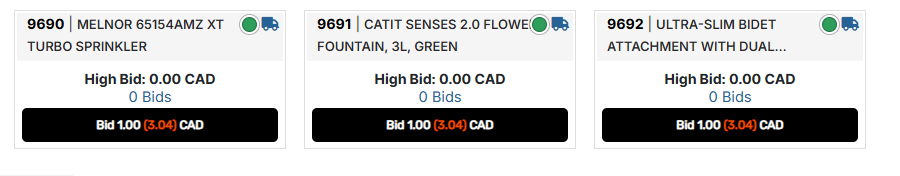

# HiBid Enhancer Suite

**Is this auction lot actually a good deal? This tells you, before you bid.**

HiBid shows you a bid amount. What it doesn't show you is what that bid will
really cost once the auction house adds its fees and tax — or whether the thing
you're bidding on is cheaper on Amazon right now.

This adds both, automatically, on every lot page and every list of lots.

 

---

## What you'll see

**The real price, not the bid price.** A $1.00 bid isn't $1.00. Add the buyer's
premium, the handling fee, the card fee and HST and it's $3.04. Every bid button
now shows both: `Bid 1.00 (3.04) CAD`.

**What it's worth new.** The script looks the product up on Amazon.ca and Best Buy
Canada and shows the price of a brand-new one, with links so you can check for
yourself.

**The most you should bid.** Working backwards from that retail price and the
auction's own fees, you get one number: the highest bid where you'd still be
getting a genuine bargain — and a walk-away point above it.

**A traffic light on every lot in a list.** When you're scanning 100 lots, a
coloured dot tells you which ones are worth a second look. Hover any dot for the
discount.

| | |
|---|---|
| 🟢 green | under half the retail price — worth a look |
| 🟡 yellow | 50–65% of retail — decent |
| 🟠 orange | 65–75% — thin once fees land |
| 🔴 red | over 75% — you're not really saving |
| ⚫ dark | listed as parts-only or broken |
| ⚪ grey | couldn't find a price — check it yourself |

**A loud warning when a lot is broken.** If the listing says parts-only, damaged
or missing pieces, you get a banner you can't miss — and the retail comparison
switches off, because a working unit's price tells you nothing about a broken one.

**Your own bids, triaged.** On your current bids page every lot tells you whether
to raise, hold, or let it go. Lots you've been outbid on that aren't worth chasing
fade into the background so they stop competing for your attention.

---

## Install

1. Install [Tampermonkey](https://www.tampermonkey.net/) — a free browser
   extension for Chrome, Edge or Firefox.
2. **[Click here to install the script](https://raw.githubusercontent.com/dgomesbr/hibid-enhancer-suite/main/src/hibid-enhancer.user.js)**
   — Tampermonkey shows an install page. Accept it.
3. Open any HiBid lot or catalog page. That's it.

The first time it runs, Tampermonkey asks permission to check prices at
`amazon.ca` and `bestbuy.ca`. **Say yes** — that's how it finds what things are
worth. Say no and everything still works except the retail comparison.

**No account, no API key, no signup.** Nothing to configure.

### Keeping it up to date

Updates install themselves. To check immediately:
**Tampermonkey → Utilities → Check for userscript updates.**

---

## Settings

Click the Tampermonkey icon while you're on a HiBid page:

| | |
|---|---|
| **settings** | Change what counts as a good deal (default: half price or better), and when you get a red warning (default: less than 25% off). |
| **clear price cache** | Prices are remembered for 12 hours. This forgets them. |
| **re-run on this page** | Redo everything on the current page. |

---

## A few honest caveats

**Auction prices move constantly.** Everything is read at the moment the page
loads. Re-check before you bid.

**Fees are read from the auctioneer's own words**, which are free text and
sometimes vague. Every number comes with a *"how these fees were determined"* note
showing the exact sentence it came from — worth opening before you bid real money.

**Sometimes it can't find a price.** A grey dot means *unknown*, never *bad deal*.
The final cost on the bid button is still exact, because that needs no lookup.

**It never bids for you.** It reads and advises. Every decision stays yours.

**Your data stays yours.** Nothing is sent anywhere except the price lookups. On
your bids page the script deliberately doesn't read your maximum bid at all,
because getting at it would mean handling your login token —
[details here](docs/current-bids.md).

---

## More detail

Everything above in depth, with the measurements behind it:

| | |
|---|---|
| [How the numbers are worked out](docs/deal-math.md) | The fee stack, the all-in cost, and how the maximum bid is derived. |
| [The lot detail page](docs/lot-detail.md) | The consolidated card, the reordering, and what it costs in page height. |
| [Catalog and lot-list pages](docs/catalog.md) | 100 lots per page, the declutter, and how it is kept fast. |
| [Current bids and watch list](docs/current-bids.md) | Raise / hold / let-go verdicts, and why no credential is touched. |
| [Finding the right product](docs/retail-matching.md) | Why a $15 accessory kept posing as a $120 motherboard, and the rules that stop it. |
| [Where prices come from](docs/PRICING-SOURCES.md) | Every Canadian pricing source evaluated, and why there is no free Amazon API. |
| [Performance](docs/performance.md) | What was measured, what was expensive, and the fixes that were tried and reverted. |
| [Development](docs/development.md) | Tests, the icon pipeline, page coverage, known limits. |
| [Releasing](RELEASING.md) | Why every fix ships as a tagged, published release. |

---

## Licence

MIT
