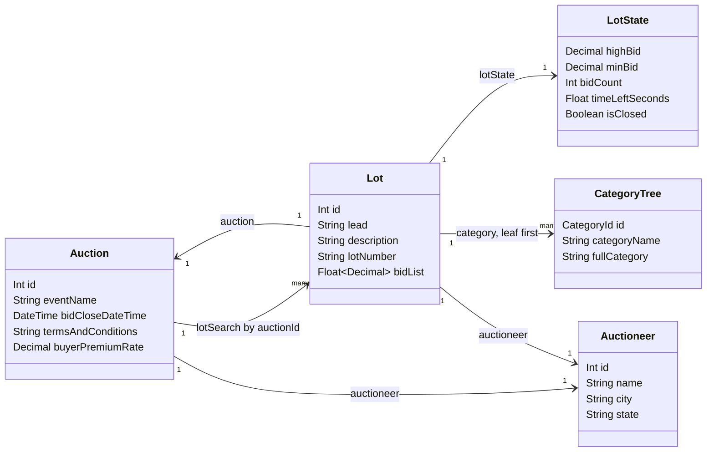
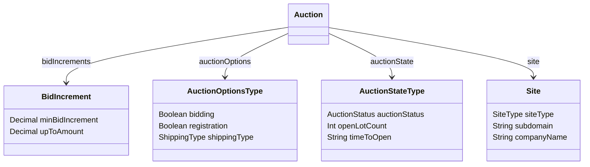
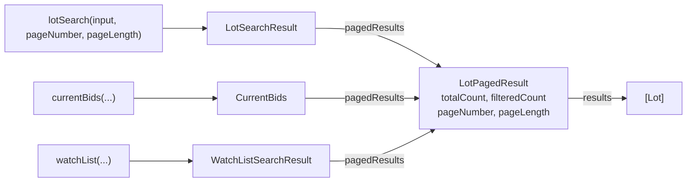
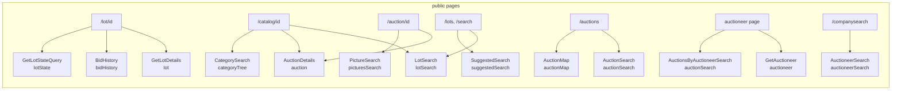
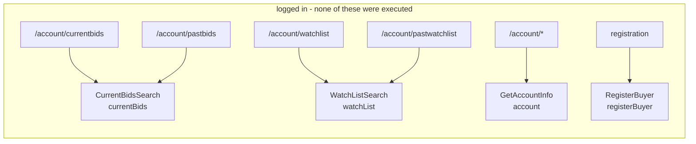
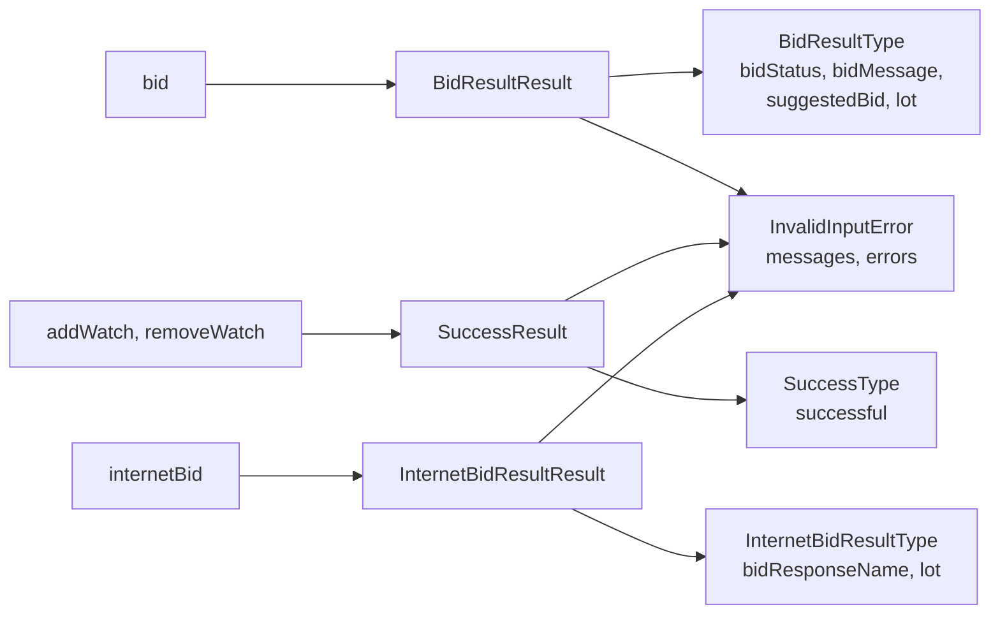

# HiBid's GraphQL endpoint

The types, fields, operations and traps behind every HiBid page that shows an
auction — what was verified against the live endpoint, what was read out of the
app's own code, and what does not exist.

`POST https://hibid.com/graphql` is the private API the HiBid Angular app talks
to. It is not published, not documented, and not versioned for outside callers.
Public catalog data needs no token, which is why this project can read a lot's
description without touching a credential (see
[Contributing](../CONTRIBUTING.md#rules-the-hard-way) for why that rule is
absolute).

**Introspection is blocked**, so none of what follows came from a schema dump.
Two methods produced it, and each field below is marked with which one:

| Mark | How it was established |
|---|---|
| **live** | Sent to the endpoint, a value came back |
| **schema** | The endpoint confirmed the field exists, by naming it or by not complaining about it, but no value was read |
| **app** | Present in a query the HiBid app itself ships, not individually re-sent |

Anything marked **schema** or **app** can be wrong about nullability and about
what the value means in practice. Anything at all can drift: this is somebody
else's internal API and it owes us nothing. Re-probe before trusting a number.

Measured on 2026-08-13 against app build `1.20.9.2`.

---

## The endpoint is scoped by host

Every auctioneer gets a subdomain, and each one serves the same schema at
`/graphql` over a different slice of the catalog. The same request to two hosts
returns different totals:

| Request | `hibid.com` | `encoreauctions.hibid.com` |
|---|---|---|
| `lotSearch(searchText: "laptop")` | 2901 lots | 55 lots |
| `auctionSearch(input: {})` | 3802 auctions | 6 auctions |
| `currentSite { siteType subdomain }` | `PUBLIC` / `WWW` | `PRIVATE` / `ENCOREAUCTIONS` |

`auction(id: 764522)` resolves on both, so an id is global while a *search* is
not. This is why the script builds its endpoint from `location.origin` rather
than hardcoding `hibid.com`: on an auctioneer's own subdomain, the public host
would answer with a corpus the page is not showing.

## `countAsView` defaults to true

`countAsView: Boolean = true` appears on four operations, and left alone it
increments a view counter on the auctioneer's side. A script that polls a catalog
inflates their analytics. Pass `false` unless a human is looking at the page.

Its position differs, which is easy to get wrong:

| Operation | Where `countAsView` goes |
|---|---|
| `auction(id:, countAsView:)` | a sibling argument |
| `lot(input:, countAsView:)` | a sibling argument |
| `lotSearch(input: { countAsView: })` | inside `input` — as a sibling it errors `Unknown argument` |
| `suggestedSearch(input: { countAsView: })` | inside `input` |

The existing queries in SECTION 16 do not pass it yet.

---

## The types

Lots hang off auctions, and everything about a lot that changes minute to minute
lives on `LotState` rather than on `Lot`.



`Auction` also carries four sub-objects that are easy to miss, because none of
them appear on a rendered catalog page:



Search results are wrapped twice. `lotSearch` returns a result object whose only
field is `pagedResults`, and the page metadata sits on the inner object:



`currentBids` and `watchList` reuse `LotPagedResult`, so the logged-in pages
return the same `Lot` objects as a public catalog search. Nothing about *your*
bid lives in a separate type; it lives in `lotState.buyerBidStatus` and
`lotState.buyerHighBid` on an ordinary `Lot`.

---

## Page to operation

Operation names here are the app's own, recovered from the shipped bundle at
`cdn.hibid.com/cdn/pwa/1.20.9.2/main.*.js`. The root field each one resolves to
is the second label.





Both `/account/currentbids` and `/account/pastbids` run `CurrentBidsSearch`; the
archive flag `isArchived` is what separates them. The watch list and past watch
list split the same way on `WatchListSearch`. There is no distinct
`pastBids` root field, and none for top picks either — the home page's
`TopLotsSearch` is `lotSearch(input: {status: TOP})` and is public.

### Every root field

`ApiQueries` is the query root. Twenty-one fields, all confirmed present.

| Field | Arguments | Returns | Notes |
|---|---|---|---|
| `lot` | `input: ID!, countAsView: Boolean = true` | `LotAccessType` | One lot by id. Wraps `{ accessability, lot }` |
| `lotSearch` | `input: LotSearchInput!, pageNumber: Int, pageLength: Int` | `LotSearchResult` | The workhorse |
| `lotState` | `input: ID!` | `LotState` | Just the volatile part, for polling |
| `bidHistory` | `input: ID!` | `BidListType` | Public, no bidder identity |
| `auction` | `id: Int!, countAsView: Boolean = true` | `Auction` | |
| `auctionSearch` | `input: AuctionSearchInput!, pageNumber, pageLength` | `AuctionSearchResult` | |
| `auctionMap` | `input: AuctionMapSearchInput!` | `AuctionMapResult` | Markers carry a whole `Auction` each |
| `auctionCount` | none | `AuctionCounts` | Site-wide totals by bid type |
| `auctioneer` | `id: Int!` | `Auctioneer` | |
| `auctioneerSearch` | `input: CompanySearchInput!, pageNumber, pageLength, sortDirection` | `AuctioneerPagedResult` | Not double-wrapped; `results` is direct |
| `categoryTree` | `input: CategorySearchInput!` | `[CategoryTree]` | Also does faceted counts |
| `categoryRedirectList` | none | `[CategoryRedirect]` | Old-to-new category url map |
| `countryState` | none | `[Country]` | 184 countries; only Canada (13) and the United States (62) carry states |
| `currentSite` | none | `Site` | Which portal you are talking to |
| `locationMap` | none | `[LocationMap]` | |
| `picturesSearch` | `input: PictureSearchInput!, pageNumber, pageLength, sortDirection` | `PicturePagedResult` | `auctionId` is required |
| `suggestedSearch` | `input: LotSearchInput!` | `HiBidESSuggestedSearchResult` | Category suggestions for a search term. `{ totalCount, suggestedSearchData: [{ categoryName, suggestData }] }`, where `suggestData` is a category id as a string |
| `webcastSearch` | `input: WebcastSearchInput!` | `WebcastResult` | Union. Requires `eventId`, `ringNumber`, `saleOrder` |
| `account` | none | `AccountInterfaceType` | Interface. `Buyer` and `Auctioneer` implement it |
| `currentBids` | `input: CurrentBidsInput!, pageNumber, pageLength, sortDirection` | `CurrentBids` | Buyer session required |
| `watchList` | `input: WatchListSearchInput!, pageNumber, pageLength, sortDirection` | `WatchListSearchResult` | Buyer session required |

The app also calls `aVStream`, `adUnit`, `approximateAddressByLatLong`,
`auctionBuyerPayInfo`, `buyerPayInfo`, `countryLotCount`, `currentEmailSubscriptions`,
`customPage`, `getFavoriteCompanies`, `isPasswordResetTokenValid`,
`iVSParticipantToken`, `liveCatalogLots`, `lotSearchPrint`,
`mailListSubscriptionStatus`, `pendingLots`, `siteStatistics`, `sitemap` and
`skyflowToken`. Those belong to live webcast bidding, ads, payment cards and
account settings, and none of them were probed here.

---

## `Lot`

Verified live on lots 316697176 and 315064591 unless noted.

| Field | Type | Verified | Notes |
|---|---|---|---|
| `id` | `Int` | live | The event-item id. This is the number in `/lot/<id>` and the one `eventItemIds` wants |
| `itemId` | `Int` | live | The auctioneer's own item id. Not the url id, not interchangeable |
| `lotNumber` | `String` | live | A string: `"1a"`, `"524a"`. Sorting it numerically will not work |
| `saleOrder` | `Int` | live | The real running order |
| `ringNumber` | `Int` | live | `0` on a timed auction |
| `lead` | `String` | live | The title. Auctioneers use lot 1 for announcements, so a lead can be `"2.4% CREDIT CARD SURCHARGE STARTING JULY 1"` rather than an item |
| `description` | `String` | live | The long text, where `Est. Retail Price` and `Condition` live |
| `estimate` | `String` | live | Formatted with a currency: `"25.92 CAD"`. Often `""` |
| `quantity` | `Float` | live | `1.0`, not `1` |
| `bidQuantity` | `String` | live | `""` on ordinary lots |
| `pictureCount` | `Int` | live | |
| `shippingOffered` | `Boolean` | live | |
| `forceLiveCatalog` | `Boolean` | live | |
| `bidAmount` | `Decimal` | live | **Always 123.45.** See the traps below. Do not use |
| `bidList` | `[Decimal]` | live | The bid ladder as absolute amounts, ~50 rungs from `minBid` up |
| `altBiddingUrl` | `String` | live | `""` when bidding is on HiBid |
| `fr8StarUrl` | `String` | live | Freight-quote deep link. Carries the pickup address in the query string, including city, province and postal code |
| `hideLeadWithDescription` | `Boolean` | live | |
| `rv` | `Int` | live | Revision counter, bumped as the lot changes |
| `simulcastStatus` | `SimulcastStatus` | live | `PENDING` on a timed lot |
| `linkTypes` | `[LinkType]` | live | Usually `[]` |
| `lotState` | `LotState` | live | |
| `auction` | `Auction` | live | Whole object, so one query gets the terms too |
| `auctioneer` | `Auctioneer` | live | Same object as `auction.auctioneer` |
| `site` | `Site` | live | |
| `category` | `[CategoryTree]` | live | **Leaf first.** Reverse it for a breadcrumb |
| `featuredPicture` | `Picture` | live | |
| `pictures` | `[Picture]` | app | |
| `links` | `[Link]` | live | `[]` on both lots tried |
| `lotNavigator` | object | schema | `{ lotCount, lotPosition, nextId, previousId }`. Came back `null` through both `lot` and `lotSearch`, so the app probably fills it only in a catalog context |

## `LotState`

Everything time-sensitive. The full field list came from the app's own `lotState`
fragment and was then re-sent field by field.

| Field | Type | Verified | Notes |
|---|---|---|---|
| `highBid` | `Decimal` | live | `0.0` before the first bid |
| `minBid` | `Decimal` | live | The next acceptable bid. Drops to `0` once the lot closes, so it is not a safe "what would I pay" once `isClosed` |
| `bidCount` | `Int` | live | |
| `status` | `LotStatus` | live | `OPEN`, `CLOSED`, `CLOSED_SHOW_STATUS`, and more |
| `isClosed` | `Boolean` | live | Can be `false` while `status` is `CLOSED_SHOW_STATUS`. Trust `status` |
| `timeLeft` | `String` | live | Display text: `"14s"`, `"Closing.."`, `"Bidding Closed"`. `""` on some auctions that are open for bidding — see the traps below |
| `timeLeftSeconds` | `Float` | live | The numeric countdown, e.g. `-57.583` once closed. `0` on the same auctions where `timeLeft` is `""`, so it is not a way round that |
| `timeLeftWithLimboSeconds` | `Float` | live | A second later than `timeLeftSeconds`; covers the soft-close limbo |
| `timeLeftTitle` | `String` | live | The tooltip, and the only place a close time appears: `"Internet Bidding closed at: 8/13/2026 8:34:00 PM EST"`. Also `""` on those same auctions |
| `timeLeftLead` | `String` | live | `""` on every lot tried, including live ones |
| `priceRealized` | `Decimal` | live | The hammer price once closed, `0` before |
| `priceRealizedPerEach` | `Decimal` | live | |
| `priceRealizedMessage` | `String` | live | `null` when the auctioneer hides the result |
| `quantitySold` | `Int` | live | |
| `softCloseMinutes` | `Int` | live | `0` on an auction with no soft close |
| `softCloseSeconds` | `Int` | live | `60` on auction 764678, where `softCloseMinutes` is `0` — check both |
| `biddingExtended` | `Boolean` | live | Soft close has fired and pushed the end out |
| `reserveSatisfied` | `Boolean` | live | `true` on a lot with no reserve at all, so it does not prove a reserve was met |
| `showReserveStatus` | `Boolean` | live | |
| `sealed` | `Boolean` | live | |
| `choiceType` | `ChoiceType` | live | `SINGLE_LOT`, `CHOICE`, `GROUP` |
| `buyNow` | `Decimal` | live | `0` when not offered |
| `productStatus` | `ProductStatus` | live | `BUY_NOW_SET` seen on a lot whose `buyNow` is `0` |
| `productUrl` | `String` | live | `null` on the lots tried |
| `bidMax` | `Decimal` | live | `0` unauthenticated |
| `bidMaxTotal` | `Decimal` | live | `0` unauthenticated |
| `highBuyerId` | `String` | live | `"0"` unauthenticated. A string, not an `Int` |
| `isLive` / `isPosted` / `isHidden` / `isArchived` / `isNotYetLive` / `isOnLiveCatalog` / `isPublicHidden` | `Boolean` | live | |
| `linkedSoftClose` | `String` | live | `""` on the lots tried |
| `showBidStatus` | `Boolean` | live | |
| `buyerBidStatus` | `BuyerBidStatus` | live | `NO_BID` unauthenticated. With a session this is the raise / hold / let-go signal |
| `buyerHighBid` | `Decimal` | live | `0` unauthenticated. **This is your maximum bid**, and the reason it is not used — see below |
| `buyerHighBidTotal` | `Decimal` | live | `0` unauthenticated |
| `isWatching` | `Boolean` | live | `false` unauthenticated |
| `isRegistered` | `Boolean` | live | `false` unauthenticated |
| `mayHaveWonStatus` | `String` | live | `""` unauthenticated |
| `watchNotes` | `String` | live | `null` unauthenticated |

The last seven answer nothing useful without a buyer session, and reaching that
session means handling a bearer token, which this project does not do
([why](current-bids.md#no-credentials-are-touched)). They are documented so the
next person can see that the field exists and that skipping it was a choice.

## `Auction`

Verified live on auction 764522.

| Field | Type | Verified | Notes |
|---|---|---|---|
| `id` | `Int` | live | |
| `eventName` | `String` | live | |
| `description` | `String` | live | Arrives with mojibake where the auctioneer pasted from Word. Run it through `normalise()` |
| `bidOpenDateTime` | `DateTime` | live | `"2026-07-28T18:53:00"`. No offset, no zone. Local to the auction |
| `bidCloseDateTime` | `DateTime` | live | The *auction's* close, not any lot's |
| `eventDateBegin` / `eventDateEnd` | `DateTime` | live | Midnight-truncated |
| `eventDateInfo` | `String` | live | Free text, and often where the real per-day closing times are stated |
| `previewDateInfo` | `String` | live | |
| `checkoutDateInfo` | `String` | live | Pickup hours as prose |
| `termsAndConditions` | `String` | live | The one reliable source of the fee stack |
| `buyerPremium` | `String` | live | Often the prose `"Please see Terms and Conditions"` |
| `buyerPremiumRate` | `Decimal` | live | A multiplier. Reads `1` on this auction while the terms say 16% |
| `showBuyerPremium` | `Boolean` | live | `false` here, which is the flag behind the empty `buyerPremium` |
| `paymentInfo` | `String` | live | Usually repeats the card surcharge |
| `shippingAndPickupInfo` | `String` | live | Carries the pickup address |
| `geoLat` / `geoLong` | `Float` | live | `42.93595 / -81.187436`. Exact coordinates, and a better province signal than parsing prose |
| `eventAddress` / `eventCity` / `eventState` / `eventZip` | `String` | live | `"23 Buchanan Crt" / "London" / "ON" / "N5Z 4P9"` |
| `currencyAbbreviation` | `String` | live | `"CAD"` |
| `lotCount` | `Int` | live | `21413`, while a catalog search on the same auction reports `totalCount` 21407 |
| `distanceMiles` | `Float` | live | `null` without a `zip` in the search |
| `regType` | `RegType` | live | `CREDIT_CARD_EVERY_TIME` |
| `bidType` | `BidType` | live | `INTERNET_ONLY` |
| `bidAmountType` | `BidAmountType` | live | `MAX_BIDDING` means proxy bidding is on |
| `holdAmount` | `Decimal` | live | `0` |
| `sourceType` | enum | live | `AFLEX` — which auctioneer software fed the listing |
| `hidden` | `Boolean` | live | |
| `visaAccepted` / `mastercardAccepted` / `amexAccepted` / `discoverAccepted` | `Boolean` | live | `true / true / false / false` |
| `biddingNotice` / `auctionNotice` | `String` | live | |
| `altBiddingUrl` / `altBiddingUrlCaption` | `String` | live | |
| `bidIncrements` | `[BidIncrement]` | live | **The structured increment schedule.** See below |
| `auctioneer` | `Auctioneer` | live | |
| `auctionOptions` | `AuctionOptionsType` | live | |
| `auctionState` | `AuctionStateType` | live | |
| `audioVideoChatInfo` | `AuctionAudioVideoChat` | live | `{ aVCEnabled, blockChat }` |
| `featuredPicture` | `Picture` | live | |
| `links` | `[Link]` | live | |
| `site` | `Site` | live | |

### `bidIncrements` replaces a text parser

`auction(id: 764522) { bidIncrements { minBidIncrement upToAmount } }` returns
the schedule as data:

| `minBidIncrement` | `upToAmount` |
|---|---|
| 1.00 | 29.00 |
| 2.50 | 97.50 |
| 10.00 | 990.00 |
| 25.00 | 9999999.99 |

SECTION 7 recovers the same table by regexing rendered page text
(`parseIncrements`, matching `"0.00 - 99.00  1.00 CAD"`). The structured field
does the same job with no parsing and no dependence on the page having rendered
the table at all.

## `Auctioneer`

| Field | Type | Verified | Notes |
|---|---|---|---|
| `id` `name` `address` `city` `state` `postalCode` `country` | `String` / `Int` | live | `country` is the full name, `"Canada"` |
| `countryId` | `Int` | live | `178` for Canada |
| `email` | `String` | live | |
| `phone` | `String` | live | Auctioneer-entered and unvalidated: on auctioneer 92115 it holds the email address, not a number |
| `fax` | `String` | live | |
| `internetAddress` | `String` | live | |
| `logo` / `logoUrl` | `String` | live | `logo` is a `cdn.hibid.com/img.axd` url; `logoUrl` was `""` |
| `missingThumbnail` | `String` | live | Placeholder image url |
| `bidIncrementDisclaimer` | `String` | live | Contains raw `<br/>` |
| `noMinimumCaption` | `String` | live | `"No Minimum"` |
| `cRMID` | `Int` | live | |
| `buyerRegNotesCaption` | `String` | app | |

There is no `latitude`, `longitude`, `description`, `website`, `url`,
`auctionCount`, `lotCount` or `rating` on `Auctioneer`. Coordinates live on
`Auction.geoLat` / `geoLong`.

## `Picture`

Five fields, and none of them is called `url`.

| Field | Type | Verified | Notes |
|---|---|---|---|
| `fullSizeLocation` | `String` | live | `cdn.hibid.com/img.axd?id=…&checksum=…`. The checksum is part of the url |
| `thumbnailLocation` | `String` | live | Same url plus `&h=350&w=350` |
| `hdThumbnailLocation` | `String` | app | |
| `description` | `String` | live | Repeats the lot's `lead` |
| `height` / `width` | `Int` | live | `0` on every picture tried, so do not size a container from them |

## Smaller types

| Type | Fields | Verified |
|---|---|---|
| `LotAccessType` | `accessability: LotAccessability`, `lot: Lot` | live — `ACCESSIBLE` |
| `LotPagedResult` | `results: [Lot]`, `totalCount`, `filteredCount`, `pageNumber`, `pageLength` | live |
| `BidListType` | `bids: [BidHistory]`, `currAbbrev`, `disclaimer`, `bidResponse`, `lead`, `lotNumber`, `lotSubNumber` | live for `bids`, app for the rest |
| `BidHistory` | `bid: Decimal`, `count: Int`, `datetime: String`, `username: String` | live for the first three |
| `CategoryTree` | `id`, `parentCategoryId`, `baseCategoryId`, `categoryName`, `fullCategory`, `description`, `header`, `uRLPath`, `hasChildren`, `lotCount`, `children: [CategoryTree]` | live |
| `Link` | `id`, `type`, `url`, `description`, `videoId` | live for the first four |
| `Site` | `siteType`, `subdomain`, `domain`, `title`, `companyName`, `fr8StarUrl`, `isDomainRequest`, `isExtraWWWRequest` | live |
| `AuctionOptionsType` | `bidding`, `altBidding`, `catalog`, `liveCatalog`, `preview`, `registration`, `webcast`, `useLotNumber`, `useSaleOrder`, `shippingType` | live |
| `AuctionStateType` | `auctionStatus`, `isRegistered`, `openLotCount`, `bidCardNumber`, `timeToOpen` | live |
| `Country` | `name`, `abbreviation`, `postalCodeMinLength`, `states: [State]` | live |
| `State` | `name`, `abbreviation`, `countryid` | live |
| `AuctionMatchType` | `matchinglotcount`, `auction: Auction` | live — note the all-lowercase field name |
| `AuctionCounts` | `allAuctions`, `webcast`, `absentee`, `biddable`, `listingOnly`, `onlineOnlyAuction`, `auctionsClosingSoon`, each an `AuctionCount { all, closingSoon }` | live for `all` |
| `Buyer` | `id`, `email`, `username`, `first`, `last`, `company`, `address`, `city`, `state`, `postalCode`, `country`, `phone`, `emailverified` | schema only |

`bidHistory` deserves a note: it is public, and it carries no bidder identity in
the fields that returned data. On lot 315064591 it gave four rows of
`{ bid, count, datetime }` and nothing else. `datetime` is a US-formatted local
string (`"8/13/2026 8:12 PM"`), not ISO.

---

## Inputs and enums

### `LotSearchInput`

| Field | Type |
|---|---|
| `auctionId` | `Int` |
| `eventItemIds` | `[Int]` |
| `category` | `CategoryId` |
| `searchText` | `String` |
| `status` | `AuctionLotStatus` |
| `sortOrder` | `EventItemSortOrder` |
| `filter` | `AuctionLotFilter` |
| `zip` | `String` |
| `miles` | `Int` |
| `state` | `String` |
| `countryName` | `String` |
| `shippingOffered` | `Boolean` |
| `isArchive` | `Boolean` |
| `dateStart` / `dateEnd` | `DateTime` |
| `hideGoogle` | `Boolean` |
| `countAsView` | `Boolean` (defaults true) |

Nothing is required — `lotSearch(input: {}, pageNumber: 1, pageLength: 1)`
validates. `searchText` matches literal substrings only, which is why the
[deal finder](../CONTRIBUTING.md) has to fan one term out into permutations.

`AuctionSearchInput` is the same shape minus `eventItemIds`, plus
`auctioneerId: Int` and `closingDate: DateTime`, and its `sortOrder` is
`EventHeadSortOrder` instead. `CategorySearchInput` and `AuctionMapSearchInput`
overlap heavily with it. `CompanySearchInput` is only
`{ name: String, state: String, sortOrder: CompanySortOrder, wildCard: Boolean, favorite: Boolean }`.
`PictureSearchInput` requires `auctionId`. `WebcastSearchInput` requires all
three of `eventId`, `ringNumber` and `saleOrder`.

`CurrentBidsInput` and `WatchListSearchInput` are identical:
`{ isArchived, groupByAuction, auctionSortDirection, hideClosedLots, auctionId, buyerLotStatusGroup, sortOrder, monthRange }`.

### `pageLength` is not capped at 100

SECTION 16's comment says `pageLength` caps at 100 server-side. It does not.
Measured against auction 764522:

| Requested | Returned |
|---|---|
| 100 | 100 |
| 101 | 101 |
| 200 | 200 |
| 250 | 250 |
| 500 | 500 |

Keeping batches at 100 is still the right call — one 500-lot response is a
heavier ask than five 100-lot ones and the script's job is to be a light guest —
but the reason is politeness, not a server limit, and the comment should say so.

### Enums

Values came out of the app bundle's compiled enum objects and the ones marked
were re-sent to confirm the endpoint accepts them.

| Enum | Values |
|---|---|
| `AuctionLotStatus` | `ALL`, `CLOSED`, `CLOSING`, `FEATURED`, `HOT`, `OPEN`, `TOP` (`ALL` `OPEN` `CLOSED` `HOT` `TOP` confirmed live) |
| `AuctionLotFilter` | `ABSENTEE`, `ALL`, `BIDDABLE`, `LISTING`, `ONLINE`, `WEBCAST` (four confirmed live) |
| `EventItemSortOrder` | `BID_AMOUNT_HIGH_TO_LOW`, `BID_AMOUNT_LOW_TO_HIGH`, `BID_COUNT_HIGH_TO_LOW`, `BID_COUNT_LOW_TO_HIGH`, `DISTANCE_NEAREST`, `HOT_RANK`, `LAST_BID`, `LOT_NUMBER`, `MAX_BID_HIGH_TO_LOW`, `MAX_BID_LOW_TO_HIGH`, `NEWLY_ADDED`, `NO_ORDER`, `PENDING_BIDS`, `SALE_ORDER`, `TIME_LEFT`, `VIEW_COUNT_HIGH_TO_LOW`, `VIEW_COUNT_LOW_TO_HIGH`, `WATCH_COUNT_HIGH_TO_LOW`, `WATCH_COUNT_LOW_TO_HIGH` |
| `EventHeadSortOrder` | `DISTANCE_NEAREST`, `NO_ORDER` — only two. Sixty-five other guesses were all rejected before the bundle settled it |
| `CompanySortOrder` | `LOCATION`, `NAME` |
| `BuyerEventItemSortOrder` | `BID_COUNT`, `BID_STATUS`, `HIGH_BID`, `LOT_NUMBER`, `MAX_BID`, `SALES_ORDER`, `TIME_LEFT` — note `SALES_ORDER`, plural, where `EventItemSortOrder` has `SALE_ORDER` |
| `BuyerLotStatusGroup` | `ALL`, `ONLYWATCHING`, `OUTBID`, `PENDING`, `WATCHING`, `WINNING` |
| `BuyerBidStatus` | `NO_BID`, `PENDING`, `WINNING`, `OUTBID`, `WON`, `PASSED`, `SEALED`, `DECLINED`, `NOT_ACCEPTED`, `MAY_HAVE_WON`, `MAY_HAVE_WON_STATUS` |
| `LotStatus` | `OPEN`, `CLOSED`, `CLOSED_SHOW_STATUS`, `LIMBO`, `LIVE`, `PASSED`, `PAUSED`, `POSTED`, `POSTED_NO_INTERNET_BIDDING`, `SOLD` |
| `AuctionStatus` | `ARCHIVED`, `CLOSED`, `NO_CATALOG_YET`, `OPEN_ABSENTEE`, `OPEN_LIVE_CATALOG`, `OPEN_WEBCAST`, `PAUSED_LIVE_CATALOG`, `POSTED`, `PREBIDDING_CLOSED` |
| `BidType` | `ABSENTEE`, `INTERNET_ONLY`, `NO_BID_TYPE`, `NO_INTERNET_BIDDING`, `SIMULCAST` |
| `BidAmountType` | `FLAT_BIDDING`, `MAX_BIDDING` |
| `RegType` | `AUTO`, `CREDIT_CARD_EVERY_TIME`, `CREDIT_CARD_FIRST_TIME`, `NONE`, `NO_CREDIT_CARD` |
| `ShippingType` | `NOT_DETERMINED`, `NOT_SET`, `NO_SHIPPING_OFFERED`, `SHIPPING_OFFERED_ALL`, `SHIPPING_OFFERED_SOME` |
| `ChoiceType` | `CHOICE`, `GROUP`, `SINGLE_LOT` |
| `LotAccessability` | `ACCESSIBLE`, `EVENTHEAD_HIDDEN`, `EVENTHEAD_NOT_FOUND`, `EVENTITEM_NOT_FOUND`, `NOT_ACCESSIBLE` |
| `LinkType` | `MAP`, `NONE`, `PDF`, `RESERVED_2`, `UNKNOWN`, `YOU_TUBE`, `YOU_TUBE_PLAYLIST` |
| `SimulcastStatus` | `LIVE`, `PASSED`, `PENDING`, `SOLD` |
| `SiteType` | `NO_SITE_TYPE`, `PORTAL`, `PRIVATE`, `PUBLIC` |
| `SortDirection` | `ASC`, `DESC` |
| `AltBidPastBidsRange` | `SIX_MONTHS`, `THREE_MONTHS`, `TWELVE_MONTHS` |

`CategoryId` and `Decimal` are custom scalars. `CategoryId` accepts the integers
that `categoryTree` returns as `id`.

---

## Mutations

`ApiMutations` is the mutation root. **Nothing here was executed.** Every probe
carried a deliberately invalid extra field, which fails document validation and
so prevents execution — that is how the argument shapes below were read out of
`Missing required field` errors without ever sending a real mutation.

| Mutation | Required input | Returns |
|---|---|---|
| `bid` | `lotId: Int!`, `bidAmount: Decimal!`, `reConfirmed: Boolean!` | `BidResultResult` |
| `internetBid` | `id: Int!`, `rv: Int!`, `useMinBid: Boolean!` (plus optional `manualBidAmount: Decimal`) | `InternetBidResultResult` |
| `addWatch` | `lotId: Int!` | `SuccessResult` |
| `removeWatch` | `lotId: Int!` | `SuccessResult` |
| `registerBuyer` | `auctionId: Int!`, `acceptTermsAndConditions: Boolean!` | `BuyerRegistrationResult` |
| `login` | not probed | `TokenResult` |
| `logout` | none | scalar |
| `changePassword` | not probed | `TokenResult` |
| `resetPassword` | not probed | `SuccessResult` |
| `createBuyerAccount` | not probed | `TokenResult` |
| `updateBuyerAccount` | not probed | `TokenResult` |

The credential-handling five were left alone on purpose. Their inputs are
visible in the app bundle if you need them; they are not reproduced here.

Results are unions, resolved with `__typename` and an inline fragment:



`InvalidInputError` is `{ messages, errors: [FieldError] }` and `FieldError` is
`{ fieldName, messages }`.

Two things are worth saying plainly. `bid` takes a bare amount and a
`reConfirmed` flag, so there is no separate "maximum bid" field — on an auction
whose `bidAmountType` is `MAX_BIDDING`, the amount you send *is* the proxy
ceiling. And `internetBid` keys off `Lot.rv`, the revision counter, which is how
the server rejects a bid aimed at a state that has already moved.

The app ships another 24 mutations covering payment cards, favourites, mailing
lists, feedback, choice-lot selection and error reporting. They were not probed
and this project has no use for them:
`AddFavoriteCompany`, `ChoiceLotsSelected`, `CompleteResetPassword`, `ContactUs`,
`CreateBuyerPayInfo`, `DeleteBuyerPayInfo`, `DeleteFavoriteCompany`, `Feedback`,
`MailListSubscribe`, `MailListUnsubscribe`, `RegisterCompleteInvite`,
`ReportClientSideError`, `ResendVerification`, `SaveWatchNotes`, `SellStuff`,
`SetBetaFlag`, `SetFavoriteCategories`, `UnwatchLot`, `UpdateBuyer`,
`UpdateBuyerNotifications`, `UpdateBuyerPayInfo`, `VerifyEmail`, `WatchLot`.

**This project will not call any of them.** Bidding and watching are out of
scope, permanently, and the reason is in
[Contributing](../CONTRIBUTING.md#what-is-out-of-scope) rather than here.

There is no subscription root. `subscription { … }` returns
`NOT_SUPPORTED`, so live lot updates are polled through `lotState`, not pushed.

---

## The traps

**`bidAmount` is the constant 123.45.** SECTION 16 records it as returning
123.45 on a lot with no bids. It is worse than that: on six lots with bid counts
of 0, 2, 3, 6 and 24, `bidAmount` was 123.45 every time. It looks like a
placeholder that was never wired up. `lotState.highBid` is the real current bid
and `lotState.minBid` the next acceptable one.

**`buyerPremiumRate` of `1` means unpopulated, not 0%.** Auction 764522 reads
`1` while its terms say 16%. `1.16` would mean 16%, so the multiplier is real
when it is set — it is just usually not set. `showBuyerPremium: false` on the
same auction is the flag behind that. Parse `termsAndConditions` and treat the
rate as a last resort, which is what SECTION 16 already does.

**`buyerPremium` is often prose, not a number.** On 764522 it is
`"Please see Terms and Conditions"`.

**Every time field can be empty on an auction that is open.** On auction 764522,
bidding open since 28 July 2026 and closing 16 August, with `lotState.status`
reading `OPEN` and `isClosed: false`, all four of `timeLeft` (`""`),
`timeLeftSeconds` (`0`), `timeLeftTitle` (`""`) and `timeLeftLead` (`""`) came back
unpopulated, re-checked on 13 August with bidding underway. On live auction 764678
the same `timeLeft` gave `"14s"`, `"Closing.."` and `"Bidding Closed"`.

So the split is not "before bidding opens" and it is not confined to the string:
whatever drives it, an auction can be open for bidding and publish no countdown of
any kind. Reaching for `timeLeftSeconds` instead of the string does not avoid the
problem, because it is `0` on exactly the auctions where the string is empty.

The only remaining time source for those auctions is the auction's own
`bidCloseDateTime`. That is what the script does as of v0.13.0: `timeLeft` when it
is populated, since it is per-lot and therefore right on an auction that staggers
its lot closes, and the auction close when it is not. The two are different claims,
so the tooltip says which one is on screen.

`timeLeftSeconds` is still the better *shape* where a countdown exists — a number
beats parsing `"6d 23h 15m"` — and switching to it would be a fair cleanup. It is
not a fix for the empty case.

**`isClosed` and `status` disagree.** Lot 315064563 came back with
`isClosed: false`, `status: CLOSED_SHOW_STATUS` and `timeLeft: "Closing.."`.
A lot in soft-close limbo is neither open nor closed by the boolean.

**`minBid` goes to 0 after close.** Lot 317152320 closed at `highBid: 26.0` with
`minBid: 0`. Reading `minBid` as "what the next bid costs" gives 0 on a closed
lot.

**`Picture.height` and `width` are 0.** On every picture returned. Sizing a
container from them collapses it.

**`Auction.lotCount` and a search's `totalCount` disagree.** 21413 against
21407 on the same auction, presumably hidden or withdrawn lots.

**`lotNumber` is a string.** `"1a"`, `"524a"`. Numeric sorting reorders the
catalog wrongly.

**`category` comes back leaf first.** `["Advertising", "Collectibles", "Antiques
& Collectibles"]` is one chain from most to least specific. A breadcrumb needs
it reversed.

**`auctioneer.phone` may not be a phone number.** Auctioneer 92115 has an email
address in it. These fields are auctioneer-entered and unvalidated.

**`description` arrives with encoding damage.** Curly apostrophes and mojibake,
because auctioneers paste from Word. This is the same class of bug that made a
premium parse fall back to 18% and turn $1.33 into $3.04, which is why
`normalise()` exists.

---

## Fields that do not exist

Each of these was sent and rejected with `Cannot query field …`. Knowing a field
is absent saves the next person the probe.

**On `Lot`:** `utcBiddingEndDate`, `biddingEndDate`, `lotEndDateTime`,
`closeDateTime`, `endDateTime`, `bidCloseDateTime`, `title`, `name`, `itemName`,
`fullDescription`, `condition`, `conditionReport`, `notes`, `lotNotes`,
`reserve`, `reservePrice`, `startingBid`, `openingBid`, `currentBid`, `highBid`,
`nextBid`, `minBid`, `bidCount`, `buyerPremium`, `premium`, `isClosed`,
`closed`, `sold`, `soldPrice`, `salePrice`, `hammerPrice`, `watched`,
`isWatched`, `myBid`, `maxBid`, `bidStatus`, `bidderStatus`, `timeLeft`,
`endDate`, `startDate`, `created`, `modified`, `updated`, `url`, `link`,
`lotUrl`, `permalink`, `slug`, `seoName`, `linkName`, `imageUrl`, `images`,
`picture`, `thumbnail`, `video`, `videoUrl`, `weight`, `dimensions`, `shipping`,
`shippingInfo`, `tax`, `taxRate`, `taxable`, `currency`,
`currencyAbbreviation`, `eventItemId`, `auctionId`, `lotId`, `itemKey`,
`bidIncrement`, `increments`, `hasReserve`, `reserveMet`, `similarLots`,
`relatedLots`, `catalogNumber`, `groupNumber`, `displayOrder`, `sortOrder`,
`rank`, `visible`, `hidden`, `published`, `distanceAway`, `distanceMiles`.

The absent time fields are the notable ones: **a lot has no close datetime.**
The only per-lot close time anywhere is the prose inside
`lotState.timeLeftTitle`. Everything else is either the auction's
`bidCloseDateTime` or a countdown.

**On `LotState`:** `secondsLeft`, `endTime`, `closeTime`, `timeRemaining`,
`biddingEndDate`, `utcBiddingEnd`, `bidAmount`, `currentBid`, `nextBid`,
`startingBid`, `openingBid`, `maxBid`, `myBid`, `myMaxBid`, `bidStatus`,
`userBidStatus`, `outbid`, `winning`, `watching`, `highBidder`, `highBidderId`,
`bidIncrement`, `increment`, `convertedHighBid`, `soldPrice`, `hammerPrice`,
`salePrice`, `hasReserve`, `reserveMet`, `isOpen`, `isPending`, `isPublic`,
`softClose`, `extended`, `extendedBidding`, `buyerBidCount`, `lotStatus`,
`displayStatus`, `statusMessage`, `label`, `bidList`, `linkedSoldLots`,
`priceRealizedPerQuantity`.

Watch the near-misses: it is `isWatching` not `watching`, `highBuyerId` not
`highBidderId`, `softCloseSeconds` not `softClose`, `biddingExtended` not
`extendedBidding`, `priceRealizedPerEach` not `priceRealizedPerQuantity`.

**On `Auction`:** `eventType`, `utcBidCloseDateTime`, `eventDateTimeBegin`,
`eventDateTimeEnd`, `eventAddress2`, `eventCountry`, `eventInfo`, `lots`,
`eventItems`, `quickLots`, `itemCount`, `category`, `categories`,
`categoryTree`, `lotState`, `state`, `status`, `isClosed`, `closed`, `isTimed`,
`isOnline`, `isWebcast`, `biddingType`, `summary`, `timeZone`,
`timeZoneAbbreviation`, `utcOffset`, `latitude`, `longitude`, `mapUrl`,
`currency`, `currencyId`, `taxRate`, `salesTax`, `seller`, `sellerName`,
`company`, `companyId`, `auctioneerId`, `created`, `modified`, `updated`,
`publishDate`, `bidderCount`, `registrationCount`, `viewCount`, `lotsPerPage`,
`pageSize`, `hideLots`, `showLots`, `lotNumbering`, `softClose`,
`softCloseMinutes`, `extendedBidding`, `priceRealized`, `totalSales`,
`invoiceInfo`, `removalInfo`, `pickupInfo`, `shippingInfo`,
`shippingInstructions`, `inspectionInfo`, `previewInfo`, `directions`,
`specialTerms`, `notes`, `lien`, `lienInfo`, `taxInfo`,
`acceptedPaymentMethods`, `paymentMethods`, `absenteeBidsAllowed`,
`requireCreditCard`, `requireRegistration`, `approvalRequired`,
`altBiddingUrlText`, `pictures`, `picture`, `linkTypes`, `rank`, `distance`.

Coordinates are `geoLat` / `geoLong`, not `latitude` / `longitude`. There is no
timezone field at all, which is what makes `bidCloseDateTime` ambiguous.

**On the query root:** `search`, `browse`, `category`, `categories`,
`categorySearch`, `event`, `eventSearch`, `eventItem`, `eventItems`,
`lotDetail`, `auctionDetail`, `catalog`, `catalogSearch`, `lotList`,
`lotsByAuction`, `bidder`, `bidderStatus`, `user`, `me`, `profile`,
`memberInfo`, `myBids`, `pastBids`, `pastWatchList`, `watchlist`,
`watchAuctionList`, `watchedAuctions`, `watchedLots`, `topPicks`,
`currentBidsSearch`, `featuredAuctions`, `upcomingAuctions`, `allAuctions`,
`similarLots`, `relatedLots`, `recommendedLots`, `popularLots`,
`bidIncrements`, `lotBidHistory`, `shippingQuote`, `settings`, `config`,
`invoice`, `invoices`, `geo`, `location`, `locations`, `states`, `countries`,
`region`, `regions`, `savedSearch`, `savedSearches`, `alerts`, `notifications`,
`tags`, `sortOptions`, `filters`, `suggestions`, `keywords`.

`currentBidsSearch` is worth calling out: `CurrentBidsSearch` is the *operation
name* the app sends, and the root field it resolves to is `currentBids`.
SECTION 16's note is right about the name and it is not a field.

**On `Auctioneer`:** `latitude`, `longitude`, `description`, `bio`, `website`,
`url`, `auctionCount`, `lotCount`, `rating`, `memberSince`, `license`,
`companyName`, `contactName`, `auctioneerName`, `address2`, `zip`, `cell`,
`mobile`, `picture`, `mapUrl`.

**On `Picture`:** `url`, `fullUrl`, `smallUrl`, `mediumUrl`, `largeUrl`,
`hiResUrl`, `imageUrl`, `location`, `path`, `src`, `id`, `caption`, `fileName`,
`sortOrder`, `isFeatured`, `hasHiRes`, `lotId`, `auctionId`.

**On `BidHistory`:** `bidderId`, `bidder`, `buyerId`, `bidderNumber`, `paddle`,
`displayName`, `name`, `amount`, `bidAmount`, `time`, `dateTime`, `bidTime`,
`date`, `utcTime`, `timestamp`, `maxBid`, `type`, `bidType`, `status`,
`isWinning`, `isHighBid`, `quantity`, `lotId`, `eventItemId`, `auctionId`,
`ip`, `source`, `method`.

**Mutations that do not exist:** `placeBid`, `submitBid`, `absenteeBid`,
`maxBid`, `setMaxBid`, `retractBid`, `cancelBid`, `watch`, `unwatch`,
`toggleWatch`, `addToWatchList`, `removeFromWatchList`, `watchAuction`,
`unwatchAuction`, `register`, `registerToBid`, `bidderRegistration`,
`createBidder`, `signIn`, `signOut`, `authenticate`, `refreshToken`,
`createAccount`, `updateAccount`, `updateProfile`, `saveSearch`, `deleteSearch`,
`createAlert`, `deleteAlert`, `subscribe`, `unsubscribe`, `checkout`, `pay`,
`payInvoice`, `submitPayment`, `addCard`, `removeCard`, `requestShipping`,
`shippingQuote`, `updateSettings`, `acceptTerms`, `agreeToTerms`, `sendMessage`,
`contactAuctioneer`, `askQuestion`, `submitQuestion`, `buyNow`, `makeOffer`,
`submitOffer`, `lotView`, `trackView`, `recordView`, `incrementView`, `ping`,
`heartbeat`, `timedBid`, `webcastBid`, `liveBid`.

Note there is no retract and no cancel. A bid, once accepted, has no mutation
that undoes it.

---

## How to probe it yourself

A bare `curl` gets a Cloudflare 403. A normal browser user-agent and a matching
`origin` is enough:

```bash
curl -s https://hibid.com/graphql \
  -H 'content-type: application/json' \
  -H 'origin: https://hibid.com' \
  -A 'Mozilla/5.0 (Windows NT 10.0; Win64; x64) AppleWebKit/537.36' \
  --data '{"operationName":"Probe","variables":{},"query":"query Probe { auction(id: 764522, countAsView: false) { id eventName currencyAbbreviation buyerPremiumRate bidIncrements { minBidIncrement upToAmount } } }"}'
```

Swap in a live auction id — 764522 has closed by now.

### Reading the schema out of the errors

Introspection is off, but validation errors are generous. Four of them together
amount to introspection:

| Ask for | Error you get | What it tells you |
|---|---|---|
| a field that does not exist | `Cannot query field 'x' on type 'Lot'. Did you mean 'y' or 'z'?` | the type's real name, and near-miss field names |
| an object field with no sub-selection | `Field lot of type LotAccessType must have a sub selection` | the field's return type |
| a field, omitting its required argument | `Argument 'input' of type 'LotSearchInput!' is required` | argument names and types |
| `input: {}` | `Missing required field 'auctionId' of type 'Int'` | which input fields are mandatory |

Two things make this fast. **One document reports every error at once**, so you
can alias forty candidate fields into a single request and classify all forty
from one response:

```bash
# a0..a2 are aliases; each error names the alias, so map them back
--data '{"query":"query P { a0: lotSearch a1: auctionMap a2: notAThing }"}'
```

And **a guard field makes a probe safe**. Any invalid field fails validation for
the whole document, and a document that fails validation is never executed. Put
one deliberately bogus field in every mutation probe and you can read argument
shapes off a mutation you have no intention of running:

```bash
--data '{"query":"mutation P { zzzGuardNeverValid bid(input: {}) { __typename } }"}'
```

That returns the required fields of `BidInput` and places no bid. Verify the
guard error is in the response before you believe anything else about it.

For enums, a wrong value is rejected and a right one is silent, so a batch of
aliased calls with one candidate each separates valid from invalid in a request.
No endpoint tried here suggests enum values, which is why
`EventHeadSortOrder` cost sixty-five wrong guesses before the bundle gave up its
two real ones.

### The app bundle is the shortcut

Everything above the enum tables took a few hundred probes. The app's own
queries would have given most of it at once, and they are a public static asset:

```bash
curl -s https://hibid.com/ | grep -o 'cdn.hibid.com/cdn/pwa/[^"]*main[^"]*\.js'
curl -s -H 'referer: https://hibid.com/' \
  'https://cdn.hibid.com/cdn/pwa/1.20.9.2/main.8a8e0d804af7211f.js' \
  | grep -o 'fragment [A-Za-z]* on [A-Za-z]* {[^}]*}'
```

The bundle carries 49 named queries, 30 mutations and 11 fragments as readable
GraphQL strings, plus the compiled enum objects. The `lotState` and `auction`
fragments are the full field selections the app itself uses, which is the
closest thing to a schema anyone outside HiBid is going to get. Note the version
in the path: the bundle url changes on every deploy, so read it from the
homepage rather than pinning it.

Probing found four fields the bundle then explained and none it contradicted, so
the two agree. Trust the bundle for names and the endpoint for behaviour.

### Being a light guest

Public data needs no token, and that is not an invitation. Read what you need
once, cache it, pace batches, and pass `countAsView: false` on anything a human
is not looking at. Never execute a mutation to learn its shape.
