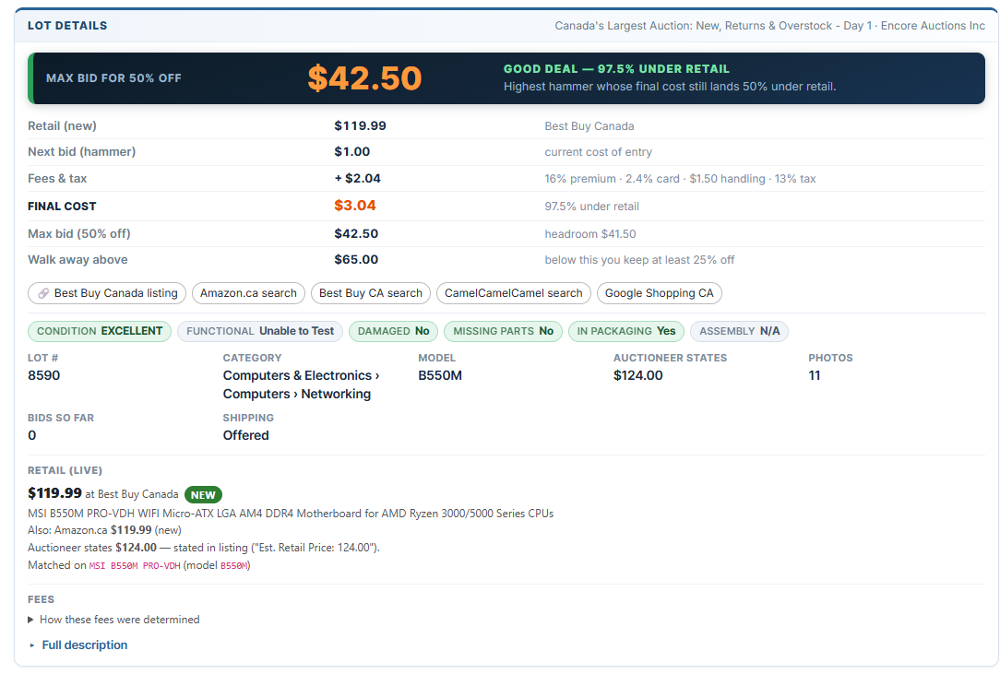
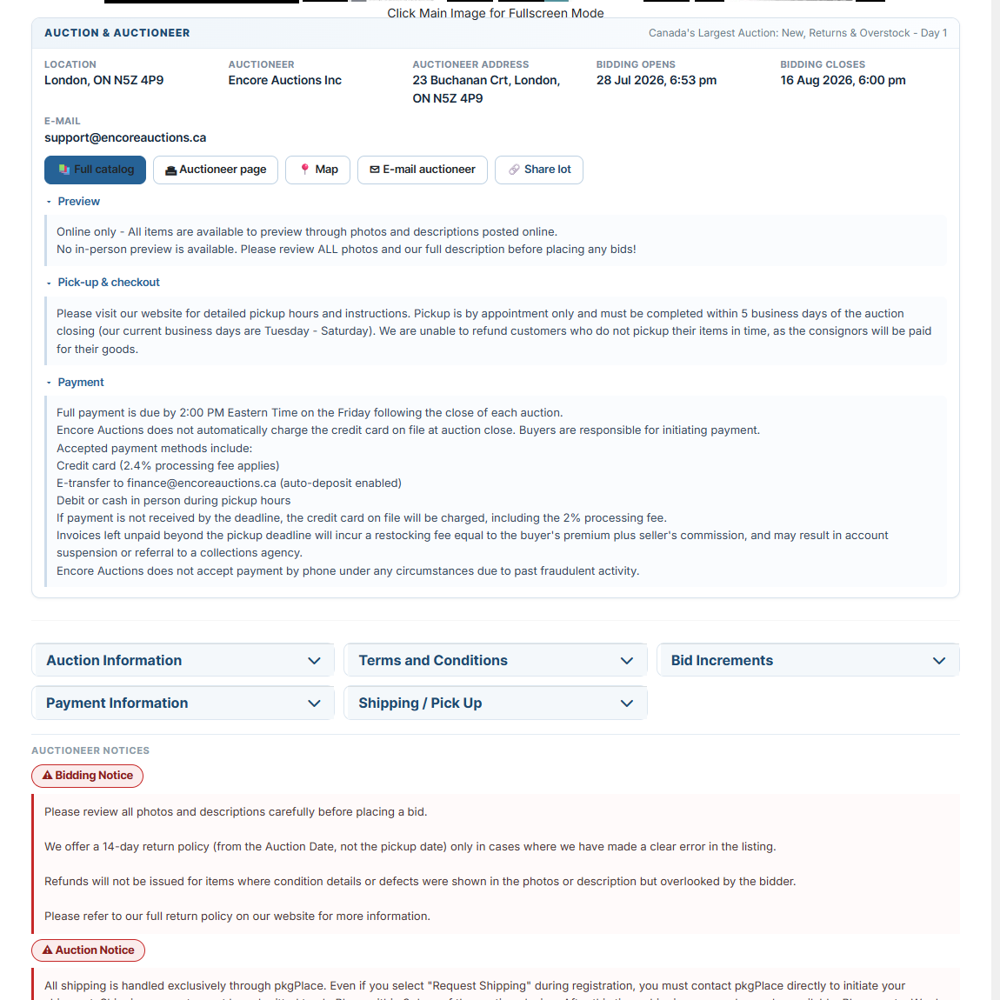
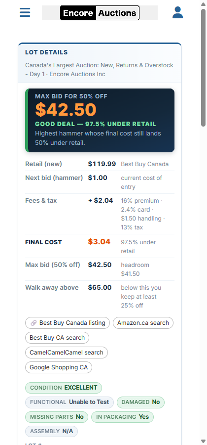

# The lot detail page

What the script adds to a single lot page, how the page is reordered around the
decision, and what that costs in height.

## What it adds

| Feature | Detail |
|---|---|
| **Product identification** | Extracts the real product name from the lot description, stripping the `Retail $328.00 \|` prefix, the `****` separator and the auctioneer's `Notes:` block. Builds a tight search query (`Sony WF-1000XM5`), keeping capacity where it moves price (`CORSAIR Vengeance DDR5 32GB`). |
| **Live retail price** | A **Retail (live)** block in the Lot details card, with the price, the matched product title, a condition badge, and deep links — including a CamelCamelCamel price-history link for the exact ASIN. Falls back to a row beneath the auctioneer's **Estimate** row if the card cannot be built. |
| **Fee-aware bid ceiling** | The highest hammer price whose all-in cost still clears your target discount, rounded down to a bid the site will actually accept. It is the max-bid box at the top of the card; the fee provenance sits lower down, and a full **Bid guidance** table appears on the fallback path. |
| **One box, decision first** | A single card, first on the page: condition banners, the max bid in its own dark box, then retail / next bid / fees & tax / **final cost** / max bid / walk-away, the lot's facts, the retail match and the folds. Styled from HiBid's own palette (brand blue `#266296`, near-black, their orange `#e65100`); money that leaves your pocket is orange. |
| **Reordered page** | The card, then the title, watch and bid, then the photos; location, dates, auctioneer and share/catalog buttons below them; the six accordions in a grid; the notices demoted to links at the foot. See [Lot detail page layout](#lot-detail-page-layout). |
| **Red bad-deal tone** | If the next required bid lands less than 25% under retail the max-bid box turns red and the hero number becomes the final cost you are about to pay, not a ceiling. |
| **Parts-only banner** | 💀 If the **lot's own** description says parts-only / broken / damaged / `Is Item Damaged? Yes`, a black-and-red banner goes above everything else, and **all retail comparison and bid advice is suppressed** — a working unit's price is not a valid comparison for a broken one. |
| **Fee provenance** | Every fee is shown with the exact sentence it was parsed from, so a wrong number is traceable instead of magic. |
| **Never blocks the page** | Two-pass rendering: everything derivable from the DOM appears instantly, the network lookup runs detached. A pulse loader in the top-right corner shows while it is in flight. |

### Structured description fields

Many auctioneers write the description as a field block rather than prose:

```
Est. Retail Price: 251.00
Condition: BRAND NEW - OPEN BOX
Model: NT-USB+
Is Item Functional? Yes
Is Item Damaged? No
Missing Major Parts? No
```

These are parsed as fields, not scanned as text, and that distinction matters:
the *label* "Is Item Damaged?" contains the word "damaged" and "Missing Major
Parts?" contains "parts", so a keyword scan flags a brand-new item as broken.
Yes/No answers are read as answers — `Is Item Damaged? No` means not damaged —
and the keyword scan only ever runs on the `Condition:` value and the remaining
prose. `Model:` is also used as the search token, which is how `NT-USB+` (a model
code with no digits in it) survives into the query.

## Page layout

HiBid's own lot page asks you to scroll past a promotional banner, a 600px photo
and two full notice cards before reaching a single number you can act on, and
then puts the lot's actual details in an accordion below the fold. The script
reorders it around the question you came to answer.

| Order | Block | Notes |
|---|---|---|
| 1 | **Lot details** card | Everything needed to decide, in one box. See below. |
| 2 | Lot title | HiBid's own `<h1>`. |
| 3 | Watch / bid strip | HiBid's own watch star, `Max: … (n)`, time remaining, truck, Bid button, Your Max. |
| 4 | Photos | The gallery, capped at 900px so a full-width column does not make it 1200px tall. |
| 5 | **Auction & auctioneer** card | Location, dates, auctioneer, contact, and catalog / auctioneer / map / e-mail / share as buttons. |
| 6 | Collapsible panels | HiBid's six accordions, in a responsive grid. |
| 7 | Auctioneer notices | Two links; click to expand the full text. |

### One box, decision first

There used to be two boxes: a dark summary panel above the title and a light Lot
details card below it. Both carried the auction name, both carried the money, and
the reader had to check whether the two agreed. They are now one card, and it is
the first thing on the page — bottom line up front:

| | |
|---|---|
| Condition banners | Parts-only / damaged / caution, when the lot's own description warrants one. First, because a warning printed under the max bid has already lost its argument. |
| **Max bid** | Its own dark box, laid out as three columns in the same order and roughly the same widths as the table below it: what the figure is, the figure in 34px, and why. Stacking the verdict under the number left two thirds of the box empty. |
| Supporting table | Retail, next bid, fees & tax, final cost, max bid, walk-away — on the light card, deliberately quieter than the box above it. |
| Condition chips | The description's structured yes/no fields, colour-coded. |
| Facts | Lot #, category, model, estimate, stated retail, photos, bids, shipping. |
| **Retail (live)** | The matched product, its price, and where it came from. |
| **Fees** | The provenance disclosure — every fee with the sentence it was parsed from. |
| Full description | Folded away. |



The decision block is still `summaryPanel()`, with the same signature, so every
branch that decides what the hero number should be — good deal, bad deal,
parts-only, no retail price found — is untouched. Only its markup and palette
changed: a dark box for the number, a light table for the evidence.

`Detail.bannerHost()` now returns the two regions the card contains, so the code
that writes condition banners and the decision has no idea which layout it is in.
When no card can be built it still returns a wrapper above the title, as before.

### Nothing Angular owns is moved

Re-parenting a component out of an Angular template is how a userscript breaks on
the next deploy. So the reorder is `flex-direction: column` plus `order` on the
columns HiBid already rendered — its nodes stay exactly where its change
detection expects them.

The blocks that appear to move to the bottom box are not moved. The originals are
hidden with `display: none` and the box is rebuilt from their own `href`s, read
out of the DOM rather than guessed, so **Full catalog** and **Auctioneer page**
point at exactly what HiBid's buttons pointed at. Share is the one replacement:
it uses `navigator.share` where available and the clipboard elsewhere, because
borrowing `app-share`'s click handler would mean depending on it.

Hiding is deliberately done twice — a class set on each run, plus `:has()`
selectors that survive an Angular re-render that replaces the nodes and takes the
class with them. The `:has()` rules sit in their own declaration blocks so a
browser without support loses those lines instead of the whole stylesheet.

The **Information** accordion is hidden rather than emptied, because
`enhanceDetail` still reads its table on every run — `textContent` works fine on
a `display: none` subtree — and it is only hidden once the replacement card is
actually on the page. If the card cannot be built, the **Retail (live)** and
**Bid guidance** rows are inserted into HiBid's table exactly as before.

### Notices become links

The Bidding and Auction notices are two always-open cards, 230–250px of text
above the lot's own details. They become two small links at the foot of the page.

Expanding one shows **more** than the card did. HiBid renders roughly the first
400 characters followed by a *Show More* anchor and fetches the rest on demand,
so the DOM copy is genuinely incomplete: on lot 316725406 the Bidding Notice is
447 characters in the page and 842 from `auction(id) { biddingNotice }`. The link
opens the GraphQL text when it arrives and a clone of the truncated card until
then — a clone, so the auctioneer's own links stay clickable.



### Pass 3 — GraphQL enrichment

A third detached pass fills in what the lot page does not put in the DOM at all.
Every field was verified against the live endpoint by sending it and reading the
error, since introspection is blocked and an unknown field is named in the
response:

- `lotSearch(eventItemIds: [id])` → `quantity`, `pictureCount`, `shippingOffered`,
  the `category` tree, and `lotState { bidCount minBid highBid }`.
- `auction(id)` → `bidOpenDateTime`, `bidCloseDateTime`, `previewDateInfo`,
  `checkoutDateInfo`, `paymentInfo`, the untruncated notices, and
  `auctioneer { name address city state postalCode email phone }`.

`bidAmount` exists on `Lot` and is **not** used: on a lot with no bids it came
back as `123.45` while `lotState.highBid` was `0`.

Like pass 2 this is fired without being awaited and guarded by the same
generation counter, so a slow or failing call leaves the DOM-derived card on
screen rather than an empty one.

Two details worth knowing:

- **Location is the page's, not the auctioneer record's.** They differ. OnDeals
  is registered at L8B 1X6 while lot 316725406 is collected at L8E 5P4, so the
  location row keeps HiBid's own city/state/zip and the auctioneer's postal
  address is a separate row that only appears when it adds something.
- **Timestamps are formatted as strings, not `Date`s.** The API returns
  `2026-08-12T19:00:00` with no offset — it is already the auction's local wall
  clock. `new Date()` would apply the viewer's timezone and reprint a 7:00 PM
  close as 11:00 PM for anyone west of the auctioneer.

### The auctioneer's banner

On an auctioneer subdomain the header slot holds a promotional image the
auctioneer uploaded — 172px on `encoreauctions.hibid.com`, with no upper bound —
advertising the sale you are already looking at. It is hidden on lot pages.

The test is the image's **rendered height**, not its selector: hibid.com's own
wordmark sits in the same slot, and a rule that removed "the header image" would
strip the site's identity on the main domain to fix a problem that only exists on
the subdomains.

### The bid strip

HiBid's own subpanel stays where it is and keeps its own controls; six of its
labels are quietened so the row reads at a glance.

| | Before | After |
|---|---|---|
| Watch | ★ **Unwatch** | ★ — the filled or hollow star already says it, and the control keeps its `aria-label` |
| Notes | *Click to add notes.* | gone — not part of deciding what to bid |
| High bid | `High Bid: 31.00 CAD` + `13 Bids` on two lines | `Max: 31.00 CAD (13)` on one, the count still the bid-history link |
| Shipping | 🚚 **Shipping Available** | 🚚 — the words move out of sight, not out of the accessibility tree |
| Your Max | `Your Max` / `60.00 CAD` wrapped apart | `Your Max 60.00 CAD` on one line |
| Gallery | *Click Main Image for Fullscreen Mode* | gone — the cursor already says so |


Five of the six are one stylesheet rule each, scoped to `body.hes-detail`. That
matters: Angular re-renders this subtree on every bid update and every countdown
tick, and an inline style set before one of those is simply gone — which is how
the catalog's share link kept coming back. A rule cannot be re-rendered away.

The sixth is text, and CSS cannot rewrite text. `Max:` and `(13)` are applied by
JavaScript from a `MutationObserver` scoped to the subpanel, because the live bid
and the bid count rewrite themselves there every few seconds and the relabel has
to win every one of those races. It is safe to run on every mutation because both
helpers return `null` once the text is already correct, so our own writes cannot
feed the observer a second time — no re-entrancy flag, no loop. The bracketed
count keeps its anchor and gains an `aria-label` of "13 bids — bid history",
because "(13)" on its own is not a usable accessible name.

### What this costs in page height

Measured at 1280px, v0.9.0 versus this build, on two Encore lots, waiting each
time until the released script had finished both its passes so "before" is the
released layout and not a half-rendered one:

| | encore lot 317094078 | encore lot 317094503 |
|---|---|---|
| Dark summary panel | 346px | gone (merged) |
| Lot details card | 422px | 804px / 715px |
| Max-bid box | — | 56px |
| `app-lot-details` total | 2110px → **2044px** | 1998px → **1950px** |
| Document | 2275px → **2209px** | 2163px → **2115px** |

**Consolidation reclaims 66px and 48px — about 3%, not 30%.** That is worth saying
plainly, because the brief hoped it would reverse the earlier growth and it does
not. Two boxes became one, and what that recovers is chrome: a card border, two
headers, the gap between them, and the dead space in the old stacked hero. It
cannot recover content, and the content is where the height is — 56px of decision
box, ~160px of supporting table, then chips, facts, the retail match and the folds.

For scale, on hibid lot 316725406 the *unenhanced* page measures 1195px of
`app-lot-details` against 2043px with this build. The enhancement is 70% of that
lot's page, and almost all of it is figures that were not on the page at all.

What would actually shorten it is folding something the reader usually does not
need — the facts grid, or the supporting table once the max bid is trusted. That
is a product decision about what a "fast decision" needs on screen, so it is
flagged here rather than taken unilaterally.

### One set of numbers, not two

The **Bid guidance** block used to repeat the decision's table almost row for row
— max bid, walk away, next bid, fees & tax, final cost — a few hundred pixels
below it. Two identical tables on one screen invite the reader to hunt for a
difference that is not there, so inside the card the table is suppressed and the
block keeps only what the decision does not carry: the fee provenance. It is
relabelled **Fees** when that happens. Worth 203px on the encore lot and 138px on
hibid.com when it landed.

The condition is the *absence of a next-bid amount*, not simply "is there a card":
`renderQuotes` draws no decision block at all when there is no bid to cost out,
and in that case the table is the only place the ceiling appears, so it stays. The
table also remains in full on the fallback path that uses HiBid's own table.

For comparison, the same lot before this consolidation:
[docs/screenshot-bluf-before.png](screenshot-bluf-before.png), and the page
as a whole after: [docs/screenshot-bluf-top.png](screenshot-bluf-top.png).

### Narrow screens

Both grids are `repeat(auto-fit, minmax(…))`, so the six accordions and the facts
collapse to one column on their own, and the bid strip is a wrapping flex row
rather than a fixed layout. The max-bid box's three columns are the one place that
needs an explicit `max-width: 640px` query, because three columns of two words are
worse than three rows. Checked at 420px: single column throughout, no horizontal
overflow.


